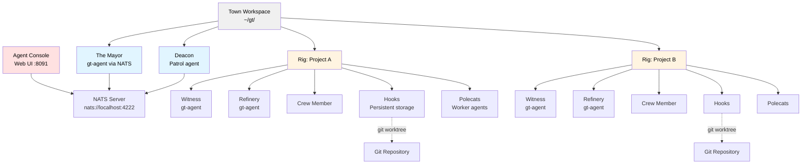
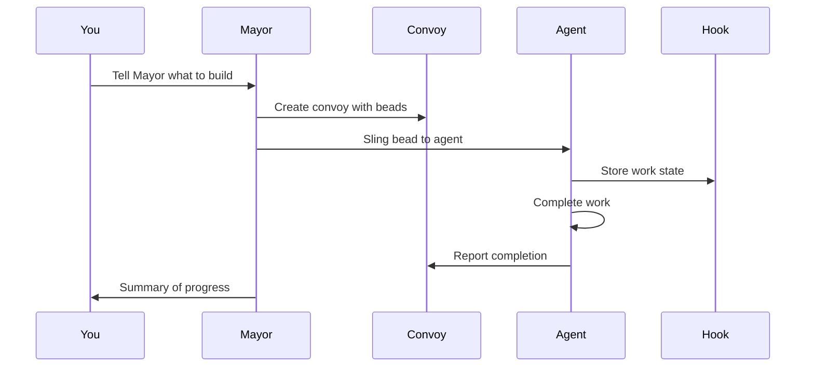
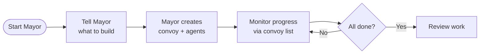
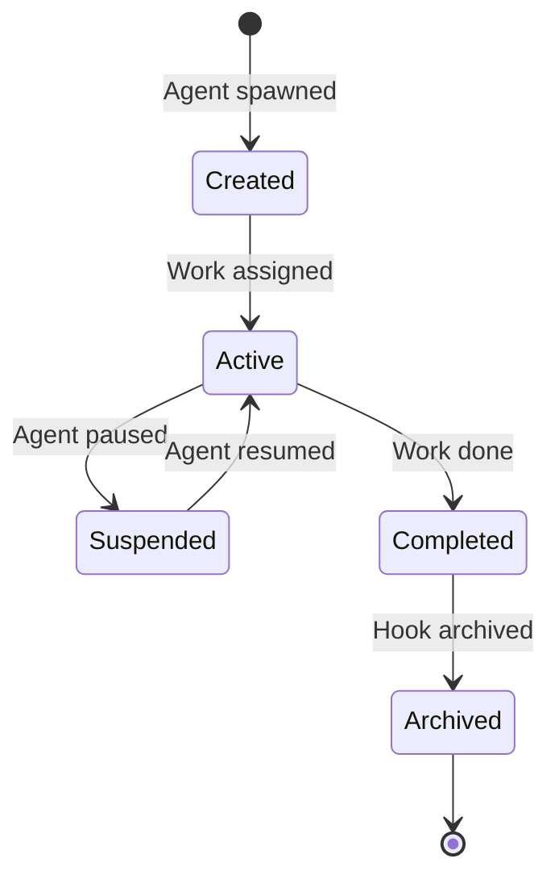

# Gas Town

**Multi-agent orchestration system with persistent work tracking — headless AI agents via NATS, web console, and git-backed hooks**

## Overview

Gas Town is a workspace manager that coordinates multiple AI coding agents working on different tasks. Agents run headlessly via the built-in `gt-agent` binary (or Claude Code, Copilot, etc.) connected through NATS messaging. Instead of losing context when agents restart, Gas Town persists work state in git-backed hooks, enabling reliable multi-agent workflows.

### What Problem Does This Solve?

| Challenge                       | Gas Town Solution                            |
| ------------------------------- | -------------------------------------------- |
| Agents lose context on restart  | Work persists in git-backed hooks            |
| Manual agent coordination       | Built-in mailboxes, identities, and handoffs |
| 4-10 agents become chaotic      | Scale comfortably to 20-30 agents            |
| Work state lost in agent memory | Work state stored in Beads ledger            |

### Architecture



## Core Concepts

### The Mayor 🎩

Your primary AI coordinator. The Mayor runs as a headless `gt-agent` process (or Claude Code, Copilot, etc.) with full context about your workspace, projects, and agents. **Start here** - just tell the Mayor what you want to accomplish.

All town-level and rig-level agents now run via `gt-agent`, a long-lived headless binary that polls for work, calls an LLM, executes shell commands, and reports results. No terminal UI required.

### Town 🏘️

Your workspace directory (e.g., `~/gt/`). Contains all projects, agents, and configuration.

### Rigs 🏗️

Project containers. Each rig wraps a git repository and manages its associated agents.

### Crew Members 👤

Your personal workspace within a rig. Where you do hands-on work.

### Polecats 🦨

Worker agents with persistent identity but ephemeral sessions. Spawned for tasks, sessions end on completion, but identity and work history persist.

### Hooks 🪝

Git worktree-based persistent storage for agent work. Survives crashes and restarts.

### Convoys 🚚

Work tracking units. Bundle multiple beads that get assigned to agents. Convoys labeled `mountain` get autonomous stall detection and smart skip logic for epic-scale execution.

### Beads Integration 📿

Git-backed issue tracking system that stores work state as structured data.

**Bead IDs** (also called **issue IDs**) use a prefix + 5-character alphanumeric format (e.g., `gt-abc12`, `hq-x7k2m`). The prefix indicates the item's origin or rig. Commands like `gt sling` and `gt convoy` accept these IDs to reference specific work items. The terms "bead" and "issue" are used interchangeably—beads are the underlying data format, while issues are the work items stored as beads.

### Molecules 🧬

Workflow templates that coordinate multi-step work. Formulas (TOML definitions) are instantiated as molecules with tracked steps. Two modes: root-only wisps (steps materialized at runtime, lightweight) and poured wisps (steps materialized as sub-wisps with checkpoint recovery). See [Molecules](docs/concepts/molecules.md).

### Orchestrator & Freeride 🎯

**New:** A deterministic **workflow FSM** coordinates rig delivery — instead of every agent discovering work independently via mail, hooks, and sling. Two pipeline templates are bundled:

| Template | Entry point | Flow |
|----------|-------------|------|
| **`rig-flow`** | Existing `SPEC.md` | Mayor kickoff → Architect → Planner → Polecat → QA |
| **`req-flow`** | Business `REQUIREMENTS.md` | Analyst → QA spec review → Architect → Planner → Polecat → QA |

| Model | How work moves |
| ----- | -------------- |
| **Legacy (autonomous)** | Mayor slings beads; polecats/crew self-dispatch via `gt prime`, mail, and patrol |
| **Orchestrator (`rig-flow` / `req-flow`)** | `gt orchestrator run` owns state; pipeline `gt-agent --orchestrated` roles poll `fetch_task` / `complete_task` over NATS |

**Freeride stack** (typical dev setup):

- **Gastown repo** — build `gt`, `gt-agent`, templates (`make install` syncs `internal/orchestrator/town/` into your town)
- **NATS** — orchestrator MCP on `gt.orchestrator.mcp` (requires `"session_transport": "nats"` in town settings)
- **Freeride proxy** (optional) — OpenAI-compatible LLM at `http://localhost:11434` for `gt-agent`; routes models by role
- **`gt-agent-console`** — web UI on port **8091** (configurable) to watch orchestrator + rig agents, workflow state, and `typescript` logs (see [Agent Console](#agent-console-))
- **codeindex** (optional, polecat host) — `pip install codeindex` for implementation blast-radius context; see freeride `README.md` (**Polecat host tools**) or [town operator notes](internal/orchestrator/town/README.md)

Patrol agents (witness, refinery, deacon, **town mechanic**) stay on the legacy loop. Pipeline roles (mayor, architect, planner, polecat, qa) use orchestrated mode when the orchestrator is running.

**Per-rig validation and prompts** come from `{rig}/mayor/rig/.gastown/workflow-profile.json` (generated by `gt rig spec-index` from `SPEC.md`), not hard-coded example paths in the template. Rig-flow prompts use `{{spec_summary}}`, `{{layout_root}}`, `{{required_files}}`, etc.

Full reference: [Orchestrator (concept)](docs/concepts/orchestrator.md) · [Technical design](docs/design/orchestrator.md)

#### Run the sample tests (Go or Python)

To quickly test the orchestrator end-to-end on a generated `ping_rig`, you can use the provided test script. From your gastown checkout directory, run:

```bash
# Test with a sample Go project (default)
./scripts/run_simple_go_test.sh

# Test with a sample Python project
./scripts/run_simple_go_test.sh python
```

This will automatically create a local rig with the appropriate specification and launch the `rig-flow` pipeline. You can monitor the progress using the Agent Console (http://127.0.0.1:8091).

### Playwright E2E Testing (Host Networking Architecture)

Gas Town supports end-to-end browser testing via **Playwright in Docker** with a **host networking** architecture:

**Key principle:** The web application runs on the **host** (not in Docker). Only the Playwright test runner runs in a Docker container with `network_mode: host` to reach the host's `localhost:<port>`.

**How it works:**

1. **Scaffold** — When a rig's workflow profile has an `integration-test` phase with both `docker-compose` and Playwright files, `gt rig add` / `gt rig spec-index` scaffolds:
   - `docker-compose.yml` — single `playwright` service
   - `package.json` — with `@playwright/test` devDependency
   - `playwright.config.ts` — configured with `baseURL: http://localhost:<DevServerPort>`
   - `e2e/*.spec.ts` — test specs (agent-written during implementation)

2. **Build** — The rig's web server is built natively on the host (e.g., `go build -o server ./cmd/server`)

3. **Run** — Start the web server on host at the port from `DevServerPort` (default 8080):
   ```bash
   ./server  # or go run ./cmd/server
   ```

4. **Test** — Run Playwright tests via docker-compose:
   ```bash
   docker compose up --exit-code-from playwright
   ```
   The container:
   - Uses `playwright-go-test:latest` image (based on `mcr.microsoft.com/playwright:v1.62.1-jammy`)
   - Runs `npm install && npx playwright test --project=chromium`
   - Reaches the web server at `http://localhost:<port>` via host networking
   - Exits with the test result code

**Why host networking?**
- No need to containerize the web app (simpler builds, faster iteration)
- Playwright runs in isolated container with browsers pre-installed
- Port is dynamic from workflow profile's `DevServerPort` (not hardcoded)
- Works identically across Go, Python, Node stacks

**Template files:** `internal/orchestrator/town/templates/rig-init/` — these are scaffolded automatically by `ScaffoldRigIntegrationTemplates()` when the profile detects an integration-test phase with both docker-compose and Playwright files.

**Test script:** `scripts/test-playwright-new-rig.sh` — creates a test rig, runs the full pipeline, verifies Playwright tests pass.

#### Try `rig-flow` on a custom rig

Prerequisites: town with at least one rig, Dolt/beads healthy, NATS transport, and an LLM endpoint (Ollama or Freeride proxy on port 11434).

```bash
# 1. Build from your gastown checkout (Freeride dev tree) and install into the town
cd /path/to/gastown          # e.g. ~/dev/freeride/gastown
SKIP_UPDATE_CHECK=1 make install

# 2. Town settings: ~/gt/settings/config.json
#    "session_transport": "nats"
#    "orchestrator": { "default_workflow": "rig-flow", "auto_start": false }

cd ~/gt
gt down && gt up
gt orchestrator sync --update-changed
gt orchestrator status          # running + PID

# 3. Register rig if needed (example)
# gt rig add testgt2 https://github.com/you/testgt2.git
# Ensure testgt2/mayor/rig/SPEC.md exists
# gt rig spec-index testgt2          # writes .gastown/workflow-profile.json from SPEC

# 4. Start the pipeline
gt mayor workflow start rig-flow --rig testgt2
gt mayor workflow status
gt feed --plain
tail -f logs/orchestrator.log

# 5. Watch the active role (see docs for full table)
tail -f testgt2/architect/typescript    # design
tail -f planner/typescript              # planning
tail -f testgt2/polecat/typescript      # implementation (orchestrator polecat, not polecats/*)
tail -f testgt2/qa/typescript           # qa_review

# 6. Agent console (recommended while debugging rig-flow)
gt-agent-console
# Open http://127.0.0.1:8091 — see Agent Console section below
```

While the workflow runs, use **`gt-agent-console`** alongside `gt mayor workflow status`:

- **Orchestrator** entry (running/stopped, `logs/orchestrator.log`)
- Per-rig **Architect / Planner / Polecat / QA** with live status (matches `GT_ROLE`, not just PID files)
- **Workflow badge** on the active FSM step (`design`, `implementation`, `qa_review`, …)
- **typescript** logs for each role (not only sparse `logs/sessions/*.log`)

```

**QA completes the FSM, not your git remote.** Polecat commits under `{rig}/mayor/rig/` locally; `git push` is blocked during orchestrated implementation. After `current_state=completed`, push from the rig worktree:

```bash
cd ~/gt/testgt2/mayor/rig
git push origin main
```

Rewind one step after deleting artifacts (orchestrator state is **not** in git):

```bash
rm -f testgt2/mayor/rig/architecture.md testgt2/mayor/rig/plan.md
gt mayor workflow reset wf-1 --to design    # or --to kickoff
gt up --orchestrator-only
```

Full rig reset (instances, beads, mail, worktree):

```bash
cd /path/to/gastown
START_RIG_FLOW=1 ./scripts/reset-rig-orchestrator.sh --force
```

#### Try `req-flow` (Requirements-driven pipeline)

Same prerequisites as `rig-flow`, but the rig must have a `REQUIREMENTS.md` file instead of `SPEC.md`. The Analyst role converts REQUIREMENTS.md → SPEC.md, then QA (spec review) validates completeness before the pipeline continues through the standard rig-flow states.

```bash
# 1. Build and install (same as rig-flow)
cd /path/to/gastown
SKIP_UPDATE_CHECK=1 make install

# 2. Create REQUIREMENTS.md instead of SPEC.md
echo "# Business requirements for MyProject" > ~/gt/myrig/mayor/rig/REQUIREMENTS.md
# (fill in your actual requirements)

# 3. Start the pipeline with req-flow template
cd ~/gt
gt mayor workflow start req-flow --rig myrig
gt mayor workflow status
```

**Pipeline stages:**

| State | Role | What happens |
|-------|------|-------------|
| `kickoff` | Mayor | Verify rig is registered and REQUIREMENTS.md exists |
| `analysis` | Analyst | Read REQUIREMENTS.md → write SPEC.md (complete technical spec) |
| `spec_review` | QA | Verify SPEC covers 100% of REQUIREMENTS; sends back to Analyst if gaps found |
| `design` | Architect | Write architecture.md from SPEC |
| `planning` | Planner | Create implementation beads + plan.md |
| `plan_review` | QA | Verify beads match architecture + required_files |
| `project_setup` | Setup | Initialize toolchain (go mod, python venv, npm install) |
| `implementation` | Polecat | Implement beads one at a time with unit tests |
| `qa_review` | QA | Review implementation, run runtime smoke, pass/fail |
| `advance_phase` | (internal) | Advance to next delivery phase or mark completed |

The same rewind, reset, and workflow management commands from `rig-flow` apply (`gt mayor workflow reset`, `gt mayor workflow status`, `gt orchestrator sync`).

### List and delete workflow instances

Workflow state is stored in `{town}/orchestrator/instances.json`. Use these scripts for a table view and safe deletion (alternative to editing JSON by hand):

```bash
cd /path/to/gastown
./scripts/list-workflows.sh
./scripts/list-workflows.sh --rig testgt1 --status active
./scripts/delete-workflows.sh wf-2 --dry-run
./scripts/delete-workflows.sh --rig testgt1 -f    # after gt orchestrator stop
./scripts/delete-workflows.sh --completed -f     # drop finished runs only
```

`gt mayor workflow status` still works when the orchestrator is running (includes live role). The list script reads `instances.json` directly and resolves **ROLE** from `orchestrator/templates/<template>.yaml`. Stop the orchestrator before delete (`gt orchestrator stop`) so in-memory state does not overwrite the file.

### Clear duplicate implementation beads

Lighter than a full rig reset — does not touch orchestrator instances, mail, or the git worktree. Use when planner retries left many open `Implementation …` tasks in the rig beads DB:

```bash
cd /path/to/gastown
./scripts/clear-implementation-beads.sh --rig testgt1 --dry-run
./scripts/clear-implementation-beads.sh --rig testgt1
```

Implementation beads live in **rig** scope (`~/gt/<rig>/.beads`). `--town` only scans town HQ (`~/gt/.beads`); HQ usually has no implementation tasks unless you use a custom `--match` (e.g. `Implement backend` for legacy `hq-*` beads).

| Flag | Effect |
|------|--------|
| `--rig <name>` | Rig beads database (typical use) |
| `--town` | Town HQ beads |
| `--match <substring>` | Filter by title; default is `validation.bead_title_contains` from `{rig}/mayor/rig/.gastown/workflow-profile.json`, else `Implementation` |
| `--all-open` | Delete every open bead in scope (role/patrol beads still kept) |
| `--all` | Delete all beads in scope; add `--include-closed` to include closed |
| `--dry-run` | Show what would be deleted |
| `-f` / `--force` | Skip the confirmation prompt |

Dolt: the script uses the **Gas Town shared server** on port 3307 (`gt dolt start` or `gt up`). It does not run per-rig `bd dolt start` (that can collide on the same port). If a rig-local `bd dolt` is holding the port, stop it with `BEADS_DIR=~/gt/<rig>/.beads bd dolt stop`, then `cd ~/gt && gt dolt start`.

After cleanup, recreate the canonical implementation beads from `plan.md`, or rewind/restart the workflow (`gt mayor workflow reset …`, then planning/implementation). Environment: `GT_ROOT=~/gt` (default `~/gt`), `KEEP_ROLE_BEADS=1` (default — skips `te-<rig>-architect|qa|refinery|witness` and patrol molecules).

When `SPEC.md` changes, refresh the per-rig profile: `gt rig spec-index <rig> --force` — see [Workflow validation](docs/concepts/orchestrator.md#workflow-validation-and-spec-profile).

### Monitoring: Witness, Deacon, Dogs 🐕

A three-tier watchdog system keeps agents healthy:

- **Witness** - Per-rig lifecycle manager. Monitors polecats, detects stuck agents, triggers recovery, manages session cleanup.
- **Deacon** - Background supervisor running continuous patrol cycles across all rigs.
- **Dogs** - Infrastructure workers dispatched by the Deacon for maintenance tasks (e.g., Boot for triage).

### Refinery 🏭

Per-rig merge queue processor. When polecats complete work via `gt done`, the Refinery batches merge requests, runs verification gates, and merges to main using a Bors-style bisecting queue. Failed MRs are isolated and either fixed inline or re-dispatched.

### Escalation 🚨

Severity-routed issue escalation. Agents that hit blockers escalate via `gt escalate`, which creates tracked beads routed through the Deacon, Mayor, and (if needed) Overseer. Severity levels: CRITICAL (P0), HIGH (P1), MEDIUM (P2). See [Escalation](docs/design/escalation.md).

### Scheduler ⏱️

Config-driven capacity governor for polecat dispatch. Prevents API rate limit exhaustion by batching dispatch under configurable concurrency limits. Default is direct dispatch; set `scheduler.max_polecats` to enable deferred dispatch with the daemon. See [Scheduler](docs/design/scheduler.md).

### Seance 👻

Session discovery and continuation. Discovers previous agent sessions via `.events.jsonl` logs, enabling agents to query their predecessors for context and decisions from earlier work.

```bash
gt seance                       # List discoverable predecessor sessions
gt seance --talk <id> -p "What did you find?"  # One-shot question
```

### Wasteland 🏜️

Federated work coordination network linking Gas Towns through DoltHub. Rigs post wanted items, claim work from other towns, submit completion evidence, and earn portable reputation via multi-dimensional stamps. See [Wasteland](docs/WASTELAND.md).

> **New to Gas Town?** See the [Glossary](docs/glossary.md) for a complete guide to terminology and concepts.

## Installation

### Prerequisites

- **Go 1.25+** - [go.dev/dl](https://go.dev/dl/)
- **Git 2.25+** - for worktree support
- **Dolt 1.82.4+** - `brew install dolt` on macOS, or see [github.com/dolthub/dolt](https://github.com/dolthub/dolt)
- **beads (bd) 0.55.4+** - installed by `brew install gastown`, or see [github.com/steveyegge/beads](https://github.com/steveyegge/beads)
- **sqlite3** - for convoy database queries (usually pre-installed on macOS/Linux)
- **NATS Server** - session transport (managed automatically via Docker on `gt up`)
- **LLM endpoint** - OpenAI-compatible API (default: `http://localhost:11434/v1/chat/completions` via Ollama)

**Optional:**
- **tmux 3.0+** - legacy session transport (set `"session_transport": "tmux"` in `settings/config.json`)
- **Claude Code CLI** - alternative agent runtime (set agent to `claude` in settings)
- **Codex CLI** - alternative agent runtime
- **GitHub Copilot CLI** - alternative agent runtime (requires Copilot seat)

### Setup (Docker-Compose below)

```bash
# Install Gas Town
$ brew install gastown                                    # Homebrew (recommended)
$ npm install -g @gastown/gt                              # npm
$ go install github.com/steveyegge/gastown/cmd/gt@latest  # From source (Linux only)

# macOS: go install produces unsigned binaries that macOS will SIGKILL.
# Use brew install (above) or install Dolt and clone/build with make:
$ brew install dolt
$ git clone https://github.com/steveyegge/gastown.git && cd gastown
$ make build && mv gt $HOME/go/bin/

# Windows (or if go install fails): clone and build manually
$ git clone https://github.com/steveyegge/gastown.git && cd gastown
$ go build -o gt.exe ./cmd/gt
$ mv gt.exe $HOME/go/bin/  # or add gastown to PATH

# If using go install, add Go binaries to PATH (add to ~/.zshrc or ~/.bashrc)
export PATH="$PATH:$HOME/go/bin"

# Create workspace with git initialization
gt install ~/gt --git
cd ~/gt

# Add your first project
gt rig add myproject https://github.com/you/repo.git

# Create your crew workspace
gt crew add yourname --rig myproject
cd myproject/crew/yourname

# Start all services (NATS, Dolt, daemon, agents)
gt up

# Open the agent console in another terminal (orchestrator + all agents)
gt-agent-console
# http://localhost:8091 — see "Agent Console" section

# Send a nudge to the Mayor from the command line
gt nudge mayor "Set up the project and create initial issues"
```

### Docker Compose

```bash
export GIT_USER="<your name>"
export GIT_EMAIL="<your email>"
export FOLDER="/Users/you/code"
export DASHBOARD_PORT=8080   # optional, host port for the convoy dashboard
export GT_AGENT_CONSOLE_PORT=8091  # optional; or: gt-agent-console --port 8091

docker compose build              # only needed on first run or after code changes
docker compose up -d

docker compose exec gastown zsh   # or bash

gt up

gh auth login                     # if you want gh to work

gt mayor attach
```

## Quick Start Guide

### Getting Started
Run
```shell
gt install ~/gt --git &&
cd ~/gt &&
gt config agent list &&
gt mayor attach
```
and tell the Mayor what you want to build!

For the **orchestrated rig pipeline** (Freeride + `rig-flow`), use [Orchestrator & Freeride](#orchestrator--freeride-rig-flow-) instead of ad-hoc Mayor slinging.

---

### Basic Workflow



### Example: Feature Development

```bash
# 1. Start the Mayor
gt mayor attach

# 2. In Mayor session, create a convoy with bead IDs
gt convoy create "Feature X" gt-abc12 gt-def34 --notify --human

# 3. Assign work to an agent
gt sling gt-abc12 myproject

# 4. Track progress
gt convoy list

# 5. Monitor agents
gt agents
```

## Tutorial: Building a Project from Scratch

Gas Town is designed for autonomous software construction. Here is how to take a project from a `SPEC.md` to a working codebase using the **Mountain-Eater** workflow.

### 1. Initialize the Rig
Add your project repository to Gas Town:
```bash
gt rig add my-project https://github.com/user/my-project.git
```

### 2. Define the Work
Navigate to the rig directory and create an **Epic** (a high-level goal):
```bash
cd my-project
bd create --title "Build Defender Clone" --type epic
```
Take note of the Epic ID (e.g., `my-abc12`).

### 3. Create Tasks
Break the project down into actionable tasks and link them to the Epic:
```bash
bd create --title "Backend: FastAPI setup" --type task --parent my-abc12
bd create --title "Frontend: Canvas rendering" --type task --parent my-abc12
```

### 4. Launch the Mountain 🏔️
Activate the "Mountain-Eater" on your Epic. This tells the system to start autonomous grinding, dispatching tasks to available polecats as capacity allows:
```bash
gt mountain my-abc12
```

### 5. Monitor Progress
Watch the software being built in real-time:
```bash
gt mountain status my-abc12  # Check epic progress
gt feed --problems           # Monitor agent health
gt dashboard --open          # Visual overview in browser
```

## Custom Agent Wrappers

Sometimes you need to inject specific environment variables or use a local LLM proxy. Gas Town supports this via **agent wrappers**.

### Creating a Claude Wrapper
Create a script (e.g., `claude_wrapper.sh`):
```bash
#!/bin/bash
export ANTHROPIC_BASE_URL="http://your-proxy:11434/v1"
export CLAUDE_CODE_BYPASS_PERMISSIONS=true
exec /usr/local/bin/claude "$@"
```
Make it executable: `chmod +x claude_wrapper.sh`.

### Registering the Wrapper
Update your `~/gt/settings/config.json` to use the wrapper:
```json
{
  "agents": {
    "claude": {
      "command": "/path/to/claude_wrapper.sh",
      "args": ["--dangerously-skip-permissions"]
    }
  }
}
```
Now all agents slung with `--agent claude` will use your wrapper.

## Common Workflows

### Mayor Workflow (Recommended)

**Best for:** Coordinating complex, multi-issue work



**Commands:**

```bash
# Attach to Mayor
gt mayor attach

# In Mayor, create convoy and let it orchestrate
gt convoy create "Auth System" gt-x7k2m gt-p9n4q --notify

# Track progress
gt convoy list
```

### Minimal Mode (No Tmux)

Run individual runtime instances manually. Gas Town just tracks state.

```bash
gt convoy create "Fix bugs" gt-abc12   # Create convoy (sling auto-creates if skipped)
gt sling gt-abc12 myproject            # Assign to worker
claude --resume                        # Agent reads mail, runs work (Claude)
# or: codex                            # Start Codex in the workspace
gt convoy list                         # Check progress
```

### Beads Formula Workflow

**Best for:** Predefined, repeatable processes

Formulas are TOML-defined workflows embedded in the `gt` binary (source in `internal/formula/formulas/`).

**Example Formula** (`internal/formula/formulas/release.formula.toml`):

```toml
description = "Standard release process"
formula = "release"
version = 1

[vars.version]
description = "The semantic version to release (e.g., 1.2.0)"
required = true

[[steps]]
id = "bump-version"
title = "Bump version"
description = "Run ./scripts/bump-version.sh {{version}}"

[[steps]]
id = "run-tests"
title = "Run tests"
description = "Run make test"
needs = ["bump-version"]

[[steps]]
id = "build"
title = "Build"
description = "Run make build"
needs = ["run-tests"]

[[steps]]
id = "create-tag"
title = "Create release tag"
description = "Run git tag -a v{{version}} -m 'Release v{{version}}'"
needs = ["build"]

[[steps]]
id = "publish"
title = "Publish"
description = "Run ./scripts/publish.sh"
needs = ["create-tag"]
```

**Execute:**

```bash
# List available formulas
bd formula list

# Run a formula with variables
bd cook release --var version=1.2.0

# Create formula instance for tracking
bd mol pour release --var version=1.2.0
```

### Manual Convoy Workflow

**Best for:** Direct control over work distribution

```bash
# Create convoy manually
gt convoy create "Bug Fixes" --human

# Add issues to existing convoy
gt convoy add hq-cv-abc gt-m3k9p gt-w5t2x

# Assign to specific agents
gt sling gt-m3k9p myproject/my-agent

# Check status
gt convoy show
```

## Runtime Configuration

Gas Town supports multiple AI coding runtimes. The default is the built-in
`gt-agent` headless binary. Per-rig runtime settings are in `settings/config.json`.

### Default: gt-agent (headless)

```json
{
  "session_transport": "nats",
  "default_agent": "gt-agent",
  "role_agents": {
    "mayor": "gt-agent",
    "deacon": "gt-agent",
    "witness": "gt-agent",
    "refinery": "gt-agent",
    "crew": "gt-agent",
    "polecat": "gt-agent"
  }
}
```

`gt-agent` is a long-lived headless binary that:
- Polls for nudges, hook work, and mail
- Calls an LLM (configurable via `LLM_ENDPOINT` env var)
- Executes shell commands and reports results
- Runs continuously until `gt down` or SIGTERM

### Alternative: Claude Code, Codex, Copilot

```json
{
  "runtime": {
    "provider": "codex",
    "command": "codex",
    "args": [],
    "prompt_mode": "none"
  }
}
```

**Notes:**

- Claude uses hooks in `.claude/settings.json` (managed via `--settings` flag) for mail injection and startup.
- For Codex, set `project_doc_fallback_filenames = ["CLAUDE.md"]` in
  `~/.codex/config.toml` so role instructions are picked up.
- For runtimes without hooks (e.g., Codex), Gas Town sends a startup fallback
  after the session is ready: `gt prime`, optional `gt mail check --inject`
  for autonomous roles, and `gt nudge deacon session-started`.
- **GitHub Copilot** (`copilot`) is a built-in preset using `--yolo` for autonomous
  mode. It uses executable lifecycle hooks in `.github/hooks/gastown.json` (same events
  as Claude: `sessionStart`, `userPromptSubmitted`, `preToolUse`, `sessionEnd`). Uses a
  5-second ready delay instead of prompt detection. Requires a Copilot seat and org-level
  CLI policy. See [docs/INSTALLING.md](docs/INSTALLING.md).

## Key Commands

### Workspace Management

```bash
gt install <path>           # Initialize workspace
gt rig add <name> <repo>    # Add project
gt rig list                 # List projects
gt crew add <name> --rig <rig>  # Create crew workspace
```

### Agent Operations

```bash
gt agents                   # List active agents
gt sling <bead-id> <rig>    # Assign work to agent
gt sling <bead-id> <rig> --agent cursor   # Override runtime for this sling/spawn
gt mayor attach             # Start Mayor session
gt mayor start --agent auggie           # Run Mayor with a specific agent alias
gt prime                    # Context recovery (run inside existing session)
gt feed                     # Real-time activity feed (TUI)
gt feed --problems          # Start in problems view (stuck agent detection)
```

**Built-in agent presets**: `claude`, `gemini`, `codex`, `cursor`, `auggie`, `amp`, `opencode`, `copilot`, `pi`, `omp`

### Convoy (Work Tracking)

```bash
gt convoy create <name> [issues...]   # Create convoy with issues
gt convoy list              # List all convoys
gt convoy show [id]         # Show convoy details
gt convoy add <convoy-id> <issue-id...>  # Add issues to convoy
```

### Configuration

```bash
# Set custom agent command
gt config agent set claude-glm "claude-glm --model glm-4"
gt config agent set codex-low "codex --thinking low"

# Set default agent
gt config default-agent claude-glm
```

### Monitoring & Health

```bash
gt escalate -s HIGH "description"  # Escalate a blocker
gt escalate list               # List open escalations
gt scheduler status            # Show scheduler state
gt seance                      # Discover previous sessions
gt seance --talk <id>          # Query a predecessor session
```

### Beads Integration

```bash
bd formula list             # List formulas
bd cook <formula>           # Execute formula
bd mol pour <formula>       # Create trackable instance
bd mol list                 # List active instances
```

### Wasteland Federation

```bash
gt wl join <remote>            # Join a wasteland
gt wl browse                   # View wanted board
gt wl claim <id>               # Claim work
gt wl done <id> --evidence <url>  # Submit completion
```

## Cooking Formulas

Gas Town includes built-in formulas for common workflows. See `internal/formula/formulas/` for available recipes.

## Activity Feed

`gt feed` launches an interactive terminal dashboard for monitoring all agent activity in real-time. It combines beads activity, agent events, and merge queue updates into a three-panel TUI. This is an alternative to the web-based Agent Console (`gt-agent-console` on port 8091):

- **Agent Tree** - Hierarchical view of all agents grouped by rig and role
- **Convoy Panel** - In-progress and recently-landed convoys
- **Event Stream** - Chronological feed of creates, completions, slings, nudges, and more

```bash
gt feed                      # Launch TUI dashboard
gt feed --problems           # Start in problems view
gt feed --plain              # Plain text output (no TUI)
gt feed --window             # Open in dedicated tmux window
gt feed --since 1h           # Events from last hour
```

**Navigation:** `j`/`k` to scroll, `Tab` to switch panels, `1`/`2`/`3` to jump to a panel, `?` for help, `q` to quit.

### Problems View

At scale (20-50+ agents), spotting stuck agents in the activity stream becomes difficult. The problems view surfaces agents needing human intervention by analyzing structured beads data.

Press `p` in `gt feed` (or start with `gt feed --problems`) to toggle the problems view, which groups agents by health state:

| State | Condition |
|-------|-----------|
| **GUPP Violation** | Hooked work with no progress for an extended period |
| **Stalled** | Hooked work with reduced progress |
| **Zombie** | Dead agent process (gt-agent or tmux session) |
| **Working** | Active, progressing normally |
| **Idle** | No hooked work |

**Intervention keys** (in problems view): `n` to nudge the selected agent, `h` to handoff (refresh context).

## Agent Console 🖥️

The **`gt-agent-console`** binary is a web UI for monitoring and interacting with
Gas Town agents. It is installed with `make install` / `brew install gastown`
alongside `gt` and `gt-agent`. Default URL: **http://127.0.0.1:8091**.

```bash
# Start the agent console (default port 8091)
gt-agent-console

# Custom port (CLI or env; CLI wins)
gt-agent-console --port 3000
GT_AGENT_CONSOLE_PORT=3000 gt-agent-console

# Bind to all interfaces (default is 127.0.0.1)
gt-agent-console --bind 0.0.0.0
GT_AGENT_CONSOLE_BIND=0.0.0.0 gt-agent-console
```

Run it from any machine that can read your town root (`GT_ROOT` / `~/gt`). It
does not replace `gt up` — start the town first, then open the console in another
terminal while debugging.

### What you see

- **Agent list** — Town agents (Mayor, Deacon, Planner) and per-rig roles (Witness, Refinery, Architect, QA, pipeline Polecat, crew)
- **Orchestrator** — `gt orchestrator run` status and activity (when using [rig-flow](#orchestrator--freeride-rig-flow-) or [`req-flow`](#try-req-flow-requirements-driven-pipeline))
- **Workflow badges** — active pipeline step highlighted on the matching agent; rig header shows `wf-1 → qa_review` style hints
- **Activity logs** — tails each role’s `typescript` file where orchestrated agents actually log; falls back to `logs/sessions/*.log`
- **Live stream** — SSE updates as new log lines appear
- **Nudges** — send messages to an agent’s queue (orchestrator itself is view-only)

### Orchestrator / pipeline debugging

When running a pipeline workflow (`rig-flow` or `req-flow`), prefer the console over
guessing which `typescript` to tail:

| FSM state | Select in console |
| --------- | ----------------- |
| analysis / spec_review | Rig → **Analyst** / **QA** (req-flow only) |
| design | Rig → **Architect** |
| planning / plan_review | Town → **Planner** / Rig → **QA** |
| project_setup | Rig → **Setup** |
| implementation | Rig → **Polecat (pipeline)** — not `polecats/*` workers |
| qa_review | Rig → **QA** |

CLI equivalents: `gt mayor workflow status`, `gt feed --plain`, `tail -f logs/orchestrator.log`.

> **Note:** The console does not start or stop agents — use `gt up` / `gt down`.
> Pipeline agents need the orchestrator running and `session_transport: "nats"`.

## Dashboard

Gas Town includes a convoy dashboard for monitoring work tracking. The dashboard
must be run from inside a Gas Town workspace (HQ) directory.

```bash
# Start dashboard (default port 8080)
gt dashboard

# Start on a custom port
gt dashboard --port 3000

# Start and automatically open in browser
gt dashboard --open
```

The dashboard gives you a single-page overview of convoys, hooks, queues,
issues, and escalations. It auto-refreshes via htmx and includes a command
palette for running gt commands directly from the browser.

## Monitoring & Health

Gas Town uses a three-tier watchdog chain to keep agents healthy at scale:

```
Daemon (Go process) ← manages NATS sessions
    ├── Mayor (gt-agent) ← work coordination
    ├── Deacon (gt-agent) ← health patrols
    ├── Boot (gt-agent) ← startup triage
    └── Per-rig:
        ├── Witness (gt-agent) ← polecat monitoring
        └── Refinery (gt-agent) ← merge queue
```

### Witness (Per-Rig)

Each rig has a Witness that monitors its polecats. The Witness detects stuck agents, triggers recovery (nudge or handoff), manages session cleanup, and tracks completion. Witnesses delegate work rather than implementing it directly.

### Deacon (Cross-Rig)

The Deacon runs continuous patrol cycles across all rigs, checking agent health, dispatching Dogs for maintenance tasks, and escalating issues that individual Witnesses can't resolve.

### Escalation

When agents hit blockers, they escalate rather than waiting:

```bash
gt escalate -s HIGH "Description of blocker"
gt escalate list                    # List open escalations
gt escalate ack <bead-id>           # Acknowledge an escalation
```

Escalations route through Deacon -> Mayor -> Overseer based on severity. See [Escalation design](docs/design/escalation.md).

## Rig Audit / Watchdog

Rig automation records an audit trail of rig-affecting operations and enforces a
disk cap on the resulting logs. Everything lives under `~/.config/gt-watchdog/`.

### Artifacts

| File | Contents |
|------|----------|
| `exec-audit.jsonl` | Every command run by `gt-agent` in orchestrated mode: session, cwd, pid, exit, timeout, output head. Keyed to a single rig+agent for post-mortem forensics. |
| `rigs-audit.jsonl` | Every `rigs.json` write (rig add/remove/spec-index/etc.): caller, pid, ppid, rig count, rigs. Catches who/what removed a rig. |
| `rig-canary.log` | Health check from the canary service (see below). |
| `rig_purge.sh` | Rotates logs over 10 MB (`gz` archive + truncate) and deletes archives older than `KEEP_DAYS` (default 7). |
| `.enabled` | Empty flag file. When absent, all audit writers and the canary exit early (no logging, no disk growth). |

### Control script

```bash
~/.config/gt-watchdog/rig-watchdog-ctl.sh status   # show systemd units + flag
~/.config/gt-watchdog/rig-watchdog-ctl.sh enable   # create .enabled, start canary + purge timer
~/.config/gt-watchdog/rig-watchdog-ctl.sh disable  # remove .enabled, stop canary + purge timer
~/.config/gt-watchdog/rig-watchdog-ctl.sh purge [days]  # rotate/truncate logs now (default 7)
```

Requires `XDG_RUNTIME_DIR` (set automatically in login shells) for `systemctl --user`.

### Systemd units (user scope)

- `gt-rig-canary.service` — probes audit writes; exits immediately when `.enabled` is missing.
- `gt-watchdog-purge.timer` / `gt-watchdog-purge.service` — daily rotation + retention.

### Integration points

- Gating is centralized in `internal/config/watchdog.go` (`WatchdogDir`,
  `WatchdogEnabled`, `MaxAuditFileBytes` = 10 MB).
- `cmd/gt-agent/orchestrated_audit.go` writes `exec-audit.jsonl` (gated on the flag
  and the size cap).
- `internal/config/loader.go` audits `rigs.json` writes through `rigs-audit.jsonl`.
- `rig_canary.py` runs as the canary service; exits early unless `.enabled` is present.

### Notes

- The old `gt-rig-backup` hardlink mirror (`rig_backup.sh`, `rig-backups/`) was
  removed: it was a single unversioned snapshot that a wipe-then-recreate cycle
  clobbered before the next timer run, so it couldn't recover rigs. Use
  `exec-audit.jsonl` + the rig's git history instead.

## Merge Queue (Refinery)

The Refinery processes completed polecat work through a bisecting merge queue:

1. Polecat runs `gt done` -> branch pushed, MR bead created
2. Refinery batches pending MRs
3. Runs verification gates on the merged stack
4. If green: all MRs in batch merge to main
5. If red: bisects to isolate the failing MR, merges the good ones

This is a Bors-style merge queue — polecats never push directly to main.

## Scheduler

The scheduler controls polecat dispatch capacity to prevent API rate limit exhaustion:

```bash
gt config set scheduler.max_polecats 5   # Enable deferred dispatch (max 5 concurrent)
gt scheduler status                      # Show scheduler state
gt scheduler pause                       # Pause dispatch
gt scheduler resume                      # Resume dispatch
```

Default mode (`max_polecats = -1`) dispatches immediately via `gt sling`. When a limit is set, the daemon dispatches incrementally, respecting capacity. See [Scheduler design](docs/design/scheduler.md).

## Seance

Discover and query previous agent sessions:

```bash
gt seance                              # List discoverable predecessor sessions
gt seance --talk <id>                  # Full context conversation with predecessor
gt seance --talk <id> -p "Question?"   # One-shot question to predecessor
```

Seance discovers sessions via `.events.jsonl` logs, enabling agents to recover context and decisions from earlier work without re-reading entire codebases.

## Wasteland Federation

The Wasteland is a federated work coordination network linking multiple Gas Towns through DoltHub:

```bash
gt wl join hop/wl-commons              # Join a wasteland
gt wl browse                           # View wanted board
gt wl claim <id>                       # Claim a wanted item
gt wl done <id> --evidence <url>       # Submit completion with evidence
gt wl post --title "Need X"            # Post new wanted item
```

Completions earn portable reputation via multi-dimensional stamps (quality, speed, complexity). See [Wasteland guide](docs/WASTELAND.md).

## Telemetry (OpenTelemetry)

Gas Town emits all agent operations as structured logs and metrics to any OTLP-compatible backend (VictoriaMetrics/VictoriaLogs by default):

```bash
# Configure OTLP endpoints
export GT_OTEL_LOGS_URL="http://localhost:9428/insert/jsonline"
export GT_OTEL_METRICS_URL="http://localhost:8428/api/v1/write"
```

**Events emitted:** session lifecycle, agent state changes, bd calls with duration, mail operations, sling/nudge/done workflows, polecat spawn/remove, formula instantiation, convoy creation, daemon restarts, and more.

**Metrics include:** `gastown.session.starts.total`, `gastown.bd.calls.total`, `gastown.polecat.spawns.total`, `gastown.done.total`, `gastown.convoy.creates.total`, and others.

See [OTEL data model](docs/otel-data-model.md) and [OTEL architecture](docs/design/otel/) for the complete event schema.

## Advanced Concepts

### The Propulsion Principle

Gas Town uses git hooks as a propulsion mechanism. Each hook is a git worktree with:

1. **Persistent state** - Work survives agent restarts
2. **Version control** - All changes tracked in git
3. **Rollback capability** - Revert to any previous state
4. **Multi-agent coordination** - Shared through git

### Hook Lifecycle



### MEOW (Mayor-Enhanced Orchestration Workflow)

MEOW is the recommended pattern:

1. **Tell the Mayor** - Describe what you want
2. **Mayor analyzes** - Breaks down into tasks
3. **Convoy creation** - Mayor creates convoy with beads
4. **Agent spawning** - Mayor spawns appropriate agents
5. **Work distribution** - Beads slung to agents via hooks
6. **Progress monitoring** - Track through convoy status
7. **Completion** - Mayor summarizes results

## Shell Completions

```bash
# Bash
gt completion bash > /etc/bash_completion.d/gt

# Zsh
gt completion zsh > "${fpath[1]}/_gt"

# Fish
gt completion fish > ~/.config/fish/completions/gt.fish
```

## Project Roles

| Role            | Description                          | Primary Interface    |
| --------------- | ------------------------------------ | -------------------- |
| **Mayor**       | AI coordinator                       | `gt mayor attach`    |
| **Human (You)** | Crew member                          | Your crew directory  |
| **Polecat**     | Worker agent                         | Spawned by Mayor     |
| **Witness**     | Per-rig agent health monitor         | Automatic patrol     |
| **Deacon**      | Cross-rig supervisor daemon          | `gt patrol`          |
| **Refinery**    | Merge queue processor                | Automatic            |
| **Hook**        | Persistent storage                   | Git worktree         |
| **Convoy**      | Work tracker                         | `gt convoy` commands |

## Tips

- **Always start with the Mayor** - It's designed to be your primary interface
- **Use convoys for coordination** - They provide visibility across agents
- **Leverage hooks for persistence** - Your work won't disappear
- **Create formulas for repeated tasks** - Save time with Beads recipes
- **Use `gt feed` for live monitoring** - Watch agent activity and catch stuck agents early
- **Monitor the dashboard** - Get real-time visibility in the browser
- **Let the Mayor orchestrate** - It knows how to manage agents

## Design Documentation

For deeper technical details, see the design docs in `docs/`:

| Topic | Document |
|-------|----------|
| Architecture | [docs/design/architecture.md](docs/design/architecture.md) |
| Glossary | [docs/glossary.md](docs/glossary.md) |
| Molecules | [docs/concepts/molecules.md](docs/concepts/molecules.md) |
| Escalation | [docs/design/escalation.md](docs/design/escalation.md) |
| Scheduler | [docs/design/scheduler.md](docs/design/scheduler.md) |
| Wasteland | [docs/WASTELAND.md](docs/WASTELAND.md) |
| OTEL data model | [docs/otel-data-model.md](docs/otel-data-model.md) |
| Witness design | [docs/design/witness-at-team-lead.md](docs/design/witness-at-team-lead.md) |
| Convoy lifecycle | [docs/design/convoy/](docs/design/convoy/) |
| Polecat lifecycle | [docs/design/polecat-lifecycle-patrol.md](docs/design/polecat-lifecycle-patrol.md) |
| Plugin system | [docs/design/plugin-system.md](docs/design/plugin-system.md) |
| Code cache | [docs/design/code-cache.md](docs/design/code-cache.md) |
| Agent providers | [docs/agent-provider-integration.md](docs/agent-provider-integration.md) |
| Hooks | [docs/HOOKS.md](docs/HOOKS.md) |
| Installation guide | [docs/INSTALLING.md](docs/INSTALLING.md) |

## Workspace Cleanup and Recovery

If you need to start fresh with a clean workspace while preserving your town configuration, use the provided cleanup script:

```bash
# Interactive cleanup (asks for confirmation)
./scripts/clean-gastown.sh ~/gt

# Non-interactive cleanup (dangerous!)
./scripts/clean-gastown.sh --force ~/gt
```

**What the script deletes:**
- All running agent processes (gt-agent, nats-wrapper)
- Rig directories and their contents
- Dolt databases (`.dolt-data/`)
- Agent state files (`gt-agent-state.json`)
- Session logs, events, and runtime artifacts
- Beads cache (`.beads/`)

**What the script preserves:**
- `config.json` (town configuration)
- `settings/` (agent and transport settings)
- `.git/` repository
- `CLAUDE.md` / `AGENTS.md`

### ⚠️ Critical: Dolt Database Recovery

**Never manually delete `.dolt-data/`**. The beads issue tracker stores all work state in Dolt databases. If databases are deleted:

1. **Agent beads cannot be created** — `gt doctor` will report missing agent/rig beads
2. **All issue history is lost** — convoys, tasks, epics, wisps
3. **`gt doctor --fix` cannot recreate beads** without a running Dolt server

**If databases are accidentally deleted:**

```bash
# Re-initialize Dolt databases (safe)
gt dolt init

# Then re-run install to recreate missing config files
gt install --force ~/gt

# Verify everything is healthy
gt doctor
```

**If you need a completely clean town**, it's safer to delete the entire `~/gt` directory and re-run `gt install ~/gt --git` than to manually delete individual subdirectories.

## Troubleshooting

### Agents lose connection

Check hooks are properly initialized:

```bash
gt hooks list
gt hooks repair
```

### Convoy stuck

Force refresh:

```bash
gt convoy refresh <convoy-id>
```

### Mayor not responding

Restart Mayor session:

```bash
gt mayor detach
gt mayor attach
```

## License

MIT License - see LICENSE file for details
