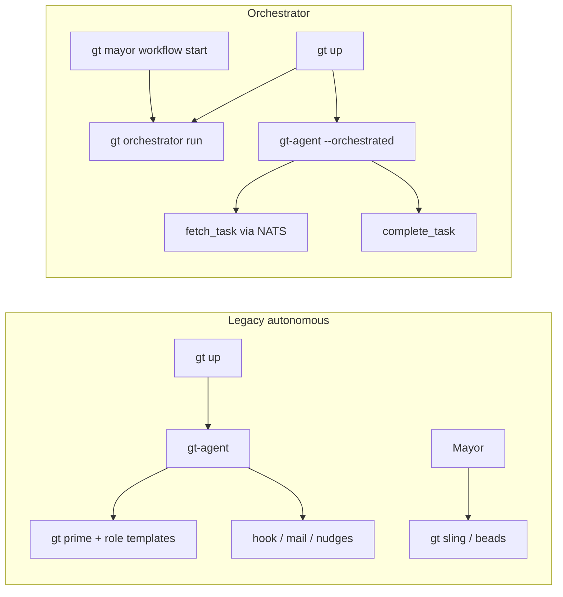

# Orchestrator

The **orchestrator** is Gas Town's workflow finite-state machine (FSM). It coordinates
multi-role rig pipelines—Mayor kickoff through Architect, Planner, Polecat, and QA—in
a single explicit state machine instead of each agent independently discovering work
via mail, hooks, and patrol.

For implementation detail, see [Orchestrator (technical)](../design/orchestrator.md).

## Why the orchestrator exists

In the **legacy (autonomous) model**, many agents run in parallel. Each uses rich role
templates (`gt prime`, embedded `*.md.tmpl` files) and self-dispatches through:

- Hook beads and `gt sling`
- Mail and nudges
- Molecules and formulas

That works well for patrol and ad-hoc work, but rig delivery pipelines (SPEC → design →
plan → implement → QA) are easy to stall: the wrong agent picks up work, handoffs fail
under NATS transport, or an agent unhooks before the mayor is notified.

The orchestrator adds a **central coordinator** that answers one question at a time:
*which role owns the pipeline right now, and what should they do?*

## Mental model

| Term | Meaning |
|------|---------|
| **Workflow template** | YAML FSM definition (e.g. `rig-flow`) loaded from `{townRoot}/orchestrator/templates/` |
| **Workflow instance** | A running execution of a template (e.g. `wf-1`) with a current state |
| **State** | A node in the FSM: one `role`, optional `prompt_file`, `instructions`, and `transitions` keyed by outcome |
| **Orchestrated agent** | `gt-agent` started with `--orchestrated`; polls the orchestrator instead of `gatherWork()` |

At any moment, exactly **one role** matches the current state. Other agents poll and
receive *no task* until the FSM advances.



## Legacy vs orchestrator

| Concern | Legacy | Orchestrator |
|---------|--------|--------------|
| **System prompt** | `buildSystemPrompt` + role `*.md.tmpl` + `gt prime --hook` | Per-state `prompt_file` under `orchestrator/prompts/` + short orchestrator wrapper |
| **Work assignment** | Hook, mail, nudges, `gt sling` | `fetch_task`: match `agent_id` to `state.role` |
| **Pipeline definition** | Mayor template + `.beads/formulas/*.toml` | YAML in `orchestrator/templates/` (e.g. `rig-flow.yaml`) |
| **Who starts the pipeline** | Mayor slings / beads | `gt mayor workflow start` or optional auto-start on `gt up` |
| **State across restart** | Beads/mail persist | `{townRoot}/orchestrator/instances.json` |

The orchestrator **does not replace** town or rig beads, convoys, or molecules. It is the
**structured rig delivery pipeline** for a registered rig with SPEC, architecture, plan,
and implementation beads.

See [Molecules](molecules.md) for formula/wisp workflows used elsewhere.

## Quickstart: `rig-flow` on `testgt2`

End-to-end example of a working orchestrator pipeline (Mayor → Architect → Planner → Polecat → QA).
Assumes town root `~/gt`, rig `testgt2`, and `session_transport: "nats"` in `settings/config.json`.

### 1. Install and bring the town up

```bash
cd /path/to/gastown
SKIP_UPDATE_CHECK=1 make install

cd ~/gt
gt down && gt up
gt orchestrator sync --update-changed
gt orchestrator status    # should show running + PID
```

### 2. Start the workflow

```bash
gt mayor workflow start rig-flow --rig testgt2
gt mayor workflow status
# → wf-1  rig-flow  state=kickoff|design|…  status=running
```

Watch progression:

```bash
gt mayor workflow status
gt feed --plain                    # workflow_start / workflow_transition events
tail -f ~/gt/logs/orchestrator.log
```

Optional: **Agent console** (`gt-agent-console`, default `http://127.0.0.1:8081`) lists the orchestrator, rig agents (Architect, QA, Polecat pipeline), workflow badges on the active step, and tails each role’s `typescript` log.

### 3. Tail the right session per state

| State | Tail |
|-------|------|
| kickoff | `~/gt/mayor/typescript` |
| design | `~/gt/testgt2/architect/typescript` |
| planning | `~/gt/planner/typescript` |
| implementation | `~/gt/testgt2/polecat/typescript` |
| qa_review | `~/gt/testgt2/qa/typescript` |

Do **not** use `~/gt/qa/typescript` for this rig — `fetch_task` expects `agent_id=testgt2/qa`.

### 4. Beads: town DB vs rig DB

`bd list` without `BEADS_DIR` shows **town HQ** beads (`hq-mayor`, patrol wisps). Implementation and QA use the **rig** database:

```bash
export BEADS_DIR=$HOME/gt/testgt2/.beads
cd ~/gt/testgt2/mayor/rig

bd list --status=open
# Filter by your profile's bead_title_contains (e.g. "Implement defender/")
bd list --status=open | grep 'Implement '
```

Only titles matching `bead_title_contains` from the rig workflow profile count for QA. Ignore open patrol / role beads (`te-testgt2-*`, etc.).

### 5. QA outcomes (what “done” means)

After polecat reports `success`, the FSM moves to `qa_review`. QA runs read-only checks plus the verify command from the workflow profile (`qa_verify_command` or `python3 -m unittest <module>`).

| Outcome | When to use |
|---------|-------------|
| `task_passed` | Verify command passed; **some** open implementation beads remain (more polecat work) |
| `all_passed` | Verify command passed; **zero** open implementation beads (pipeline complete) |
| `failure` | Tests or SPEC/architecture not met → back to implementation |

Example JSON (after commands have actually run):

```json
{"outcome":"task_passed","summary":"tests OK; 3 open implementation beads remain"}
```

`gt-agent` **rejects** `all_passed` if open implementation beads still exist, even when the model claims they are closed. Close remaining beads in implementation, then re-run QA with `all_passed`.

### 6. Verify a healthy run

```bash
gt mayor workflow status
# current_state=completed  status=completed   (after all_passed)

export BEADS_DIR=$HOME/gt/testgt2/.beads
bd list --status=open
```

### 7. Reset and retry

**Rewind the FSM** (keeps the same `wf-*` id) when you deleted `architecture.md` / `plan.md` but the orchestrator already advanced:

```bash
rm -f testgt2/mayor/rig/architecture.md testgt2/mayor/rig/plan.md
gt orchestrator stop    # optional; reset works offline too
gt mayor workflow reset wf-1 --to design
gt orchestrator start
gt up --orchestrator-only
```

Use `--to kickoff` to run mayor kickoff again. Restart the orchestrator after `make install` so it exposes the `reset_workflow` MCP tool.

**Full rig reset** (remove workflow instances for that rig, beads, mail, worktree):

```bash
cd /path/to/gastown
bash scripts/reset-rig-orchestrator.sh --force
gt mayor workflow start rig-flow --rig testgt2
```

**List / delete workflow instances** (`orchestrator/instances.json`):

```bash
./scripts/list-workflows.sh
./scripts/delete-workflows.sh wf-2 --dry-run
./scripts/delete-workflows.sh --rig testgt2 -f   # stop orchestrator first
```

**Clear implementation beads only** (duplicate `Implementation …` tasks from planner retries; does not reset instances or the worktree). See [README — Clear duplicate implementation beads](../README.md#clear-duplicate-implementation-beads):

```bash
./scripts/clear-implementation-beads.sh --rig testgt2 --dry-run
./scripts/clear-implementation-beads.sh --rig testgt2
```

## Workflow validation and spec profile

Rig-flow guards (bead title prefix, required files, min sizes, test command) are **per rig**, not baked into prompts as a fixed example project.

### Generate profile from SPEC

```bash
gt rig spec-index testgt2
# → testgt2/mayor/rig/.gastown/workflow-profile.json

gt rig spec-index testgt2 --force   # after SPEC.md changes
```

`gt rig add` and `gt rig adopt` run spec-index automatically when `SPEC.md` exists (best-effort; requires LLM endpoint).

Example profile fields (also sent to `gt-agent` on `fetch_task` and substituted into prompts):

| Field | Purpose |
|-------|---------|
| `layout_root` | Top-level code directory under `mayor/rig/` (e.g. `defender`, `backend`) |
| `bead_title_contains` | Prefix for implementation beads (`Implement defender/…`) |
| `required_files` | Paths QA/polecat must respect |
| `spec_summary` | Short project description for architect/planner prompts |
| `min_architecture_bytes` / `min_plan_bytes` | Size guards for `architecture.md` / `plan.md` |
| `min_implementation_file_bytes` / `min_substantive_lines` | QA stub guard: rejects tiny/placeholder files under `layout_root` (language-agnostic) |
| `qa_verify_command` / `unittest_module` / `test_runner` | QA test invocation |

Town copy of `orchestrator/templates/rig-flow.yaml` has **placeholder** `validation:` defaults only; the running workflow merges **profile overrides template overrides defaults**.

Prompts under `orchestrator/prompts/rig-flow/` use `{{spec_summary}}`, `{{layout_root}}`, `{{required_files}}`, `{{bead_title_contains}}`, `{{min_architecture_bytes}}`, etc. — sync via `make install` or `gt orchestrator sync --update-changed`.

`gt-agent` applies merged validation for design, planning, implementation, and QA guards.

## Configuration

### Town settings (`~/gt/settings/config.json`)

```json
"orchestrator": {
  "default_workflow": "rig-flow",
  "auto_start": false
}
```

| Field | Meaning |
|-------|---------|
| `default_workflow` | Template id to start when `auto_start` is true (e.g. `rig-flow`) |
| `auto_start` | If true, `gt up` and `gt rig add` call `MaybeAutoStartWorkflow` when no active instance exists for that template/rig |

When `auto_start` is false (default), you must start a workflow explicitly:

```bash
gt mayor workflow start rig-flow --rig testgt2
```

Other town settings that affect orchestrated agents:

| Setting | Effect |
|---------|--------|
| `session_transport` | `nats` required for orchestrator MCP (`gt.orchestrator.mcp`) |
| `role_agents` | Which LLM/runtime each role uses (unchanged from legacy) |

### Town assets (templates + prompts)

Runtime files live under `{townRoot}/orchestrator/`:

```
orchestrator/
  templates/rig-flow.yaml
  prompts/rig-flow/kickoff.md
  prompts/rig-flow/design.md
  ...
  instances.json          # persisted workflow state (Phase 2)
```

**Source of truth in gastown:** `internal/orchestrator/town/` — installed by `make install`,
`gt install`, or `gt orchestrator sync --update-changed`.

### Environment (optional)

| Variable | Default | Meaning |
|----------|---------|---------|
| `GT_ORCH_POLL_INTERVAL` | `15s` | Idle poll interval for `--orchestrated` agents |
| `GT_SESSION_TRANSPORT` | from settings | Town session transport (use `nats` with orchestrator) |

## Which sessions to watch (rig-flow on `testgt2`)

Pipeline agents use **orchestrated** `gt-agent` with rig-scoped `agent_id` where required.
Tail the **rig-scoped** session, not the town `hq-*` duplicate when a single rig is registered.

| FSM state | Role | Session / log to tail | `fetch_task` agent_id |
|-----------|------|------------------------|------------------------|
| kickoff | mayor | `~/gt/mayor/typescript` | `mayor` |
| design | architect | `~/gt/testgt2/architect/typescript` | `testgt2/architect` |
| planning | planner | `~/gt/planner/typescript` | `planner` (town-level) |
| implementation | polecat | `~/gt/testgt2/polecat/typescript` | `testgt2/polecat` |
| qa_review | qa | `~/gt/testgt2/qa/typescript` | `testgt2/qa` |

**Do not confuse with:**

| Path | Why it is wrong for rig-flow |
|------|------------------------------|
| `~/gt/qa/typescript` | Town `hq-qa`: `agent_id="qa"` — does **not** match when workflow has `rig: testgt2` |
| `~/gt/testgt2/polecats/*/typescript` | Legacy per-bead polecats (witness/sling); **not** the orchestrator implementation step |
| `~/gt/testgt2/mayor/rig/typescript` | Often refinery/legacy noise committed into the worktree — not the orchestrator polecat |

Orchestrator service log:

```bash
tail -f ~/gt/logs/orchestrator.log
```

## What agents do when orchestrated

**Pipeline roles** (mayor, architect, planner, polecat, qa) use orchestrator dispatch when
the service is running. They do **not** run legacy `gatherWork()` / `gt prime` patrol while idle.

1. **Poll** NATS (`gt.orchestrator.mcp`) for `fetch_task`
2. If **no task** — sleep (`GT_ORCH_POLL_INTERVAL`, default 15s). **No LLM call.**
3. If a task matches:
   - Load **system prompt** from `prompt_file` (e.g. `orchestrator/prompts/rig-flow/design.md`)
   - Run **CMD:** lines, then JSON `outcome` / `summary` when the step is done
   - Call `complete_task`; FSM advances if the outcome matches a transition key

**Patrol roles** (witness, refinery, mechanic, deacon) are **not** orchestrated — they keep
the legacy patrol loop even when the orchestrator is running.

## Operator commands

From town root (`~/gt`):

```bash
# Town + orchestrator service
gt up
gt orchestrator status
gt orchestrator sync --update-changed   # refresh templates/prompts from gastown binary

# Workflow lifecycle
gt mayor workflow start rig-flow --rig testgt2
gt mayor workflow status
gt mayor workflow status wf-1
gt mayor workflow complete wf-1 success   # manual advance if stuck
gt mayor workflow reset wf-1 --to design  # rewind FSM (e.g. after deleting architecture.md)

# Rig profile from SPEC
gt rig spec-index testgt2

# Observe
tail -f logs/orchestrator.log
```

`gt up --orchestrator-only` starts NATS, Dolt, daemon, orchestrator, and pipeline agents but skips legacy town `hq-architect` / `hq-qa` / `hq-polecat` when the orchestrator is running.

After gastown code changes:

```bash
gt down
cd /path/to/gastown && make install
cd ~/gt && gt up
gt orchestrator sync --update-changed
# Workflow persists in orchestrator/instances.json — use reset or a new start, not git, to rewind
```

## Example: `rig-flow` on `testgt2`

| State | Role | Main artifacts / actions |
|-------|------|---------------------------|
| kickoff | mayor | Rig registered, `testgt2/mayor/rig/SPEC.md` |
| design | architect | `architecture.md` (scope from SPEC + profile; no implementation code) |
| planning | planner | `plan.md` + `bd create` beads matching profile `bead_title_contains` |
| implementation | polecat (`testgt2/polecat`) | Claim/close one implementation bead under `layout_root/` |
| qa_review | qa (`testgt2/qa`) | Review; outcomes `task_passed`, `all_passed`, or `failure` |

Template variables such as `{{rig}}` are substituted in prompts and instructions when the
workflow is started with `--rig testgt2`.

**Implementation success** requires `complete_task outcome=success` (polecat must actually
finish a bead). **Failure** on implementation loops in `implementation` (see `rig-flow.yaml`).

## Troubleshooting

### QA never gets a task (`ORCHESTRATED` only, no `Task wf=...`)

1. Check workflow state — QA only runs in `qa_review`:
   ```bash
   gt mayor workflow status
   cat ~/gt/orchestrator/instances.json
   ```
2. If `current_state` is still `implementation`, polecat has not reported `success` yet.
   Tail `~/gt/polecat/typescript`, not `testgt2/polecats/*`.
3. Confirm you tail **`testgt2/qa/typescript`**, not `~/gt/qa/typescript` (`agent_id` must be `testgt2/qa`).
4. In `logs/orchestrator.log`, look for:
   ```text
   Checking WF wf-1 state qa_review role qa against testgt2/qa
   ```
   If you only see `implementation role polecat against testgt2/qa`, the FSM is not in QA yet.

### Planner rejects commands / false success

- Do not use `gt bd add` — use `cd <rig>/mayor/rig && bd create --type task --title "..."`.
- Bead titles and file paths must match `workflow-profile.json` / `architecture.md`, not a generic example layout.

### Deleted architecture.md but FSM still at planning

Orchestrator state lives in `orchestrator/instances.json`, not git. Rewind:

```bash
gt mayor workflow reset wf-1 --to design
```

Then remove stale `plan.md` if present and `gt up --orchestrator-only`.

### Architect wrote wrong project (ignored SPEC)

Ensure `gt rig spec-index <rig>` ran and prompts are current (`make install`, `gt orchestrator sync --update-changed`). Design prompts are spec-driven (`{{spec_summary}}`); stale town copies of old FizzBuzz example prompts cause this.

### `gt up` reports daemon failed but daemon is running

Under heavy parallel startup, the daemon may need more than 300ms to acquire `daemon.lock`. Recent builds poll up to 3s (same as `gt daemon start`). Check `gt daemon status` and `gt daemon logs`.

### Deacon stuck stopped / crash loop

```bash
gt daemon clear-backoff deacon
gt deacon restart
```

With NATS transport, `gt status -v` uses PID files and process-tree checks (not tmux). A stale wrapper PID without a live `gt-agent` child is cleaned on the next heartbeat.

### Polecat stuck on `gt bd list -t`

- `gt bd` is **not** the beads CLI. Use bare `bd` from `{rig}/mayor/rig`.
- Orchestrator polecat is **`~/gt/polecat`**, not named polecats under `polecats/`.

### Workflow lost after orchestrator restart

Instances persist in `orchestrator/instances.json` and resume on `gt up` (see “resumed N active at …”). If missing, run `gt mayor workflow start rig-flow --rig <rig>` again.

### Wrong files committed to `testgt2` git remote

Orchestrator polecat should only commit under `{rig}/mayor/rig/` (ideally `backend/` only).
Avoid `git add .` (commits `typescript`, `.claude/`, etc.). Legacy sling polecats use separate
git branches under `origin/polecat/*` — distinct from `main`.

## Current limitations

- **QA outcome names** — FSM uses `task_passed` / `all_passed` / `failure`; agents often emit `success` / `fail` (partial alias mapping; prefer explicit QA outcomes in prompts).
- **Legacy polecats** — witness may still spawn per-bead polecats under `{rig}/polecats/`; paused from `gt up --restore` while `rig-flow` is active, but sling can still create work outside the FSM.
- **hq duplicate sessions** — with one rig, town `hq-architect` / `hq-qa` are skipped; with zero rigs they would still start.
- **Not Cursor IDE MCP** — orchestrator uses NATS JSON-RPC for `gt-agent`, not Claude/Cursor `mcpServers`.

## Related reading

- [Orchestrator (technical)](../design/orchestrator.md)
- [Gas Town Architecture](../design/architecture.md)
- [Molecules](molecules.md)
- [Overview](../overview.md)
