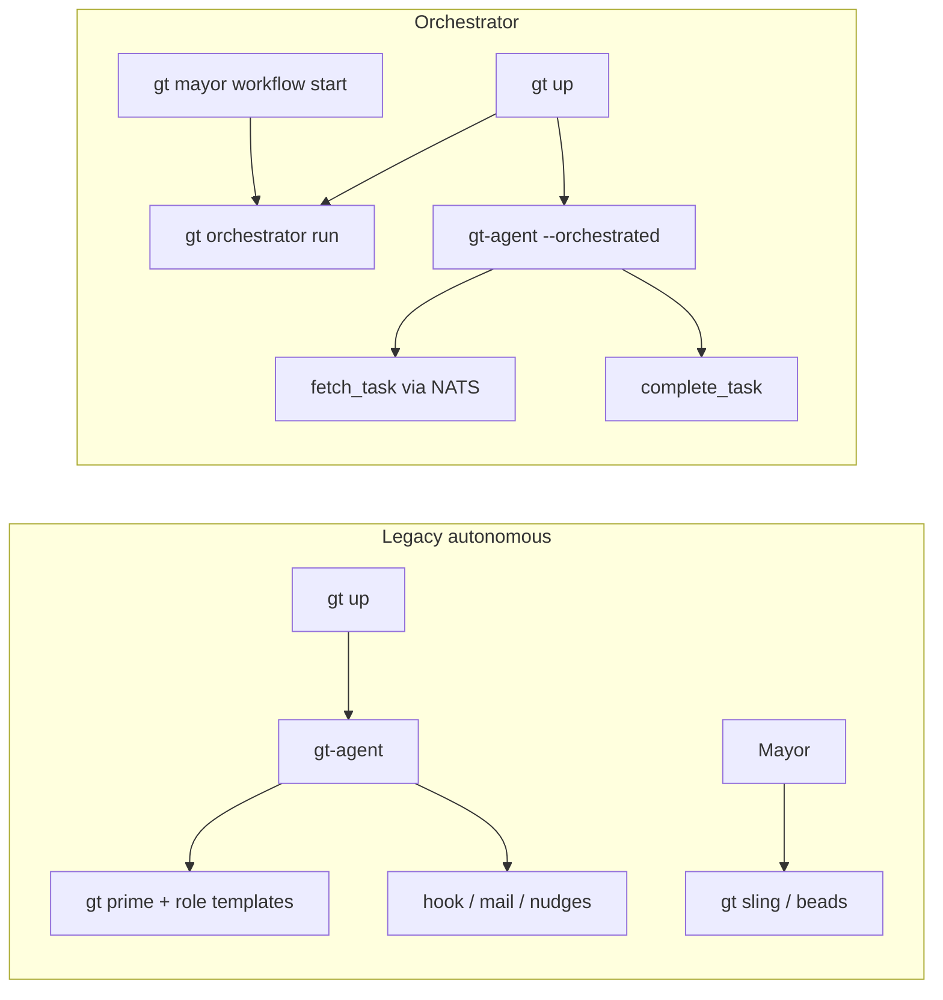

# Orchestrator

The **orchestrator** is Gas Town's workflow finite-state machine (FSM). It coordinates
multi-role rig pipelines—Mayor kickoff through Architect, Planner, Polecat, and QA—in
a single explicit state machine instead of each agent independently discovering work
via mail, hooks, and patrol.

For implementation detail, see [Orchestrator (technical)](../design/orchestrator.md).

## Why the orchestrator exists

In the **legacy (autonomous) model**, many agents run in parallel. Each uses rich role
templates (`gt prime`, embedded `*.md.tmpl` files) and self-dispatches through:

- Hook beads and `gt sling`
- Mail and nudges
- Molecules and formulas

That works well for patrol and ad-hoc work, but rig delivery pipelines (SPEC → design →
plan → implement → QA) are easy to stall: the wrong agent picks up work, handoffs fail
under NATS transport, or an agent unhooks before the mayor is notified.

The orchestrator adds a **central coordinator** that answers one question at a time:
*which role owns the pipeline right now, and what should they do?*

## Mental model

| Term | Meaning |
|------|---------|
| **Workflow template** | YAML FSM definition (e.g. `rig-flow`) loaded from `{townRoot}/orchestrator/templates/` |
| **Workflow instance** | A running execution of a template (e.g. `wf-1`) with a current state |
| **State** | A node in the FSM: one `role`, `instructions`, and `transitions` keyed by outcome |
| **Orchestrated agent** | `gt-agent` started with `--orchestrated`; polls the orchestrator instead of `gatherWork()` |

At any moment, exactly **one role** matches the current state. Other agents poll and
receive *no task* until the FSM advances.



## Legacy vs orchestrator

| Concern | Legacy | Orchestrator (current) |
|---------|--------|------------------------|
| **System prompt** | `buildSystemPrompt` + `internal/templates/roles/*.md.tmpl` + `gt prime --hook` | Short inline prompt + YAML `instructions` only |
| **Work assignment** | Hook, mail, nudges, `gt sling` | `fetch_task`: match agent ID to `state.role` |
| **Pipeline definition** | Mayor template + `.beads/formulas/*.toml` | YAML in `orchestrator/templates/` (e.g. `rig-flow.yaml`) |
| **Who starts the pipeline** | Mayor slings / creates project bead | Manual: `gt mayor workflow start <template>` |
| **State across restart** | Beads/mail persist | Workflow instances in memory only (today) |

The orchestrator **does not replace** town or rig beads, convoys, or molecules. It is the
**structured rig delivery pipeline** for projects like a registered rig with SPEC,
architecture, plan, and implementation beads.

See [Molecules](molecules.md) for formula/wisp workflows used elsewhere.

## What you configure

**Town templates** (runtime, not embedded in the binary):

```
{townRoot}/orchestrator/templates/
  rig-flow.yaml      # Mayor → Architect → Planner → Polecat → QA
  build-spec.yaml    # Shorter bootstrap pipeline
  sample.yaml        # hello-world demo
```

**Town settings** (future): `orchestrator.default_workflow`, `orchestrator.auto_start`
in `settings/config.json`.

**Gastown-bundled examples** under `internal/orchestrator/templates/` must use the same
schema as town templates (`role:`, not `agent_role:`). See the technical doc.

## What agents do when orchestrated

Pipeline agents (Mayor, Architect, Planner, Polecat, QA) use the **orchestrator-only**
path when the service is running. They do **not** run the legacy patrol loop or call the
LLM while idle.

1. **Poll** NATS (`gt.orchestrator.mcp`) for `fetch_task`
2. If **no task** — sleep (configurable interval) and poll again. **No LLM call.**
3. If a task matches their role:
   - Load **system prompt** from the state’s prompt file (e.g. `orchestrator/prompts/rig-flow/design.md`)
   - Send a **user prompt** to complete **this step only** (one FSM state = one task)
   - Run any `CMD:` blocks, then return **structured output** (`outcome`, `summary`, …)
   - Call `complete_task` with the outcome and return to step 1

Prompt files are kept **separate from YAML** so each step can be focused and sized for
less capable models. Content is lifted from legacy role templates but trimmed to the
current state only.

**Patrol roles** (Witness, Refinery, Mechanic, Deacon) are not part of the rig pipeline
FSM unless given their own workflow. They should not use `--orchestrated` idle polling
with an LLM; Mechanic may remain a deterministic shell patrol.

## Operator workflow

All `gt` and `bd` commands for a town run from the town root (e.g. `/home/stevef/gt`).

1. **Start the town** (with NATS session transport if configured):
   ```bash
   cd ~/gt
   gt up
   ```
   Confirm orchestrator is running: `gt orchestrator status` or `daemon/orchestrator.pid`.

2. **Start a workflow** (required today; not automatic on `gt up`):
   ```bash
   gt mayor workflow start rig-flow
   ```

3. **Observe progress**:
   ```bash
   tail -f logs/orchestrator.log
   ```
   States should advance: `kickoff` → `design` → `planning` → `implementation` → `qa_review` → `completed`.

4. **After gastown code changes**:
   ```bash
   gt down
   cd /path/to/gastown && make install
   cd ~/gt && gt up
   gt mayor workflow start rig-flow   # again, until persistence lands
   ```

## Example: testgt2 rig-flow

Template `rig-flow` (in the town's `orchestrator/templates/rig-flow.yaml`) drives:

| State | Role | Main artifact |
|-------|------|----------------|
| kickoff | mayor | Rig registered, SPEC present |
| design | architect | `testgt2/mayor/rig/architecture.md` |
| planning | planner | Beads + `plan.md` |
| implementation | polecat | Claim/close implementation beads |
| qa_review | qa | Verify; loop or complete |

Variables such as `rig: testgt2` are planned but not yet substituted in instructions.

## Current limitations

Honest status as of the `mcp-orchestrator` branch:

- **Persistence** — workflow instances saved to `{townRoot}/orchestrator/instances.json` (survives orchestrator restart)
- **Optional auto-start** — `orchestrator.auto_start` + `default_workflow` in `settings/config.json`; `gt up` and `gt rig add` call `MaybeAutoStartWorkflow`
- **Per-state prompt files** — `prompt_file` in FSM YAML; assets synced from `internal/orchestrator/town/`
- **Multi-turn CMD loop** — agents may run several CMD turns per state; structured JSON outcome when no CMD lines remain
- **Legacy path still reachable** — witness-spawned polecats and some dual hq/rig agents (Phase 3 topology)
- **Outcome mismatch** — QA states may expect `task_passed` / `all_passed` / `failure`; agents often emit `success` / `fail` (aliases partially mapped)
- **Duplicate town vs rig agents** — e.g. `hq-qa` vs `testgt2/qa` when multiple rigs exist
- **Not Cursor IDE MCP** — orchestrator speaks JSON-RPC on NATS for `gt-agent`, not Claude/Cursor `mcpServers`

## Where we are going

Target design (confirmed):

1. **Per-state prompt files** — `orchestrator/prompts/{template}/{state}.md`, referenced from FSM YAML
2. **One task per LLM call** — structured output, then `complete_task`, then poll again
3. **Idle = poll + sleep only** — no LLM while waiting for work
4. **Orchestrator-only pipeline** — no parallel legacy `gatherWork` / prime patrol for pipeline roles
5. **Persistence + auto-start** (Phase 2) — survive restart; optional default workflow on `gt up`
6. **Rig-scoped matching** — one architect/qa/polecat session per rig in a workflow

See [Orchestrator (technical)](../design/orchestrator.md) for the implementation roadmap.

## Related reading

- [Orchestrator (technical)](../design/orchestrator.md)
- [Gas Town Architecture](../design/architecture.md) — beads levels, role storage
- [Molecules](molecules.md) — formulas and wisps
- [Overview](../overview.md) — role taxonomy
