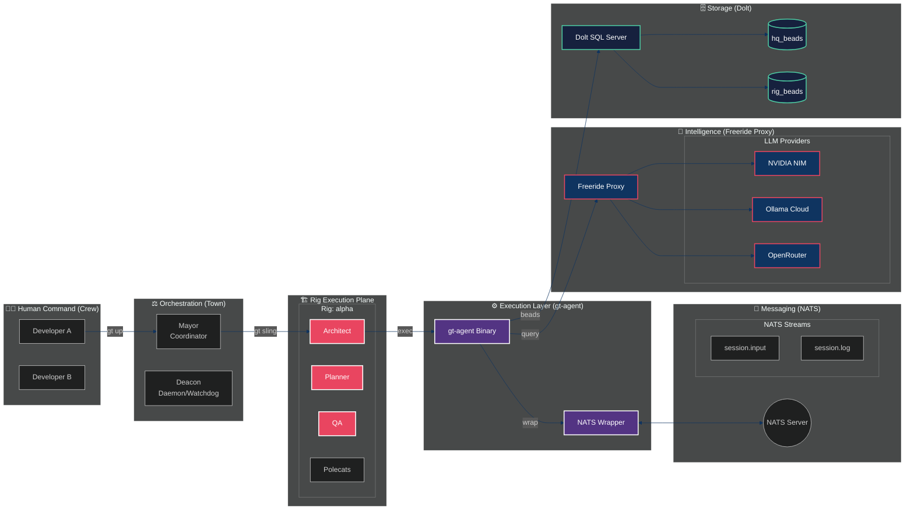
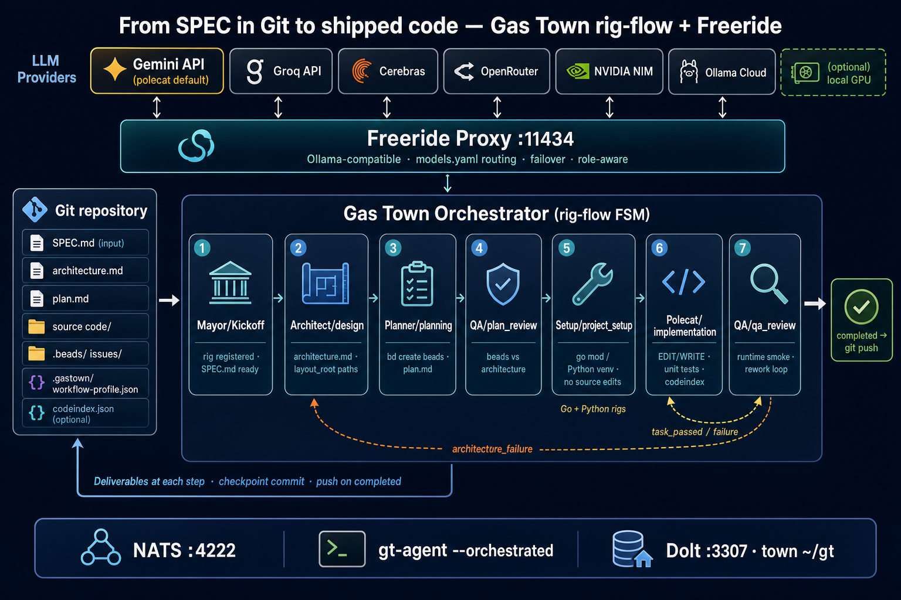

# Gas Town Architecture

Technical architecture for Gas Town multi-agent workspace management.

## Two-Level Beads Architecture

Gas Town uses a two-level beads architecture to separate organizational coordination
from project implementation work.

| Level | Location | Prefix | Purpose |
|-------|----------|--------|---------|
| **Town** | `~/gt/.beads/` | `hq-*` | Cross-rig coordination, Mayor mail, agent identity |
| **Rig** | `<rig>/mayor/rig/.beads/` | project prefix | Implementation work, MRs, project issues |

### Town-Level Beads (`~/gt/.beads/`)

Organizational chain for cross-rig coordination:
- Mayor mail and messages
- Convoy coordination (batch work across rigs)
- Strategic issues and decisions
- **Town-level agent beads** (Mayor, Deacon)
- **Role definition beads** (global templates)

### Rig-Level Beads (`<rig>/mayor/rig/.beads/`)

Project chain for implementation work:
- Bugs, features, tasks for the project
- Merge requests and code reviews
- Project-specific molecules
- **Rig-level agent beads** (Witness, Refinery, Polecats)

## Agent Bead Storage

Agent beads track lifecycle state for each agent. Storage location depends on
the agent's scope.

| Agent Type | Scope | Bead Location | Bead ID Format |
|------------|-------|---------------|----------------|
| Mayor | Town | `~/gt/.beads/` | `hq-mayor` |
| Deacon | Town | `~/gt/.beads/` | `hq-deacon` |
| Boot | Town | `~/gt/.beads/` | `hq-boot` |
| Planner | Town | `~/gt/.beads/` | `hq-planner` |
| Mechanic | Town | `~/gt/.beads/` | `hq-mechanic` |
| Dogs | Town | `~/gt/.beads/` | `hq-dog-<name>` |
| Witness | Rig | `<rig>/.beads/` | `<prefix>-<rig>-witness` |
| Refinery | Rig | `<rig>/.beads/` | `<prefix>-<rig>-refinery` |
| Architect | Rig | `<rig>/.beads/` | `<prefix>-<rig>-architect` |
| QA | Rig | `<rig>/.beads/` | `<prefix>-<rig>-qa` |
| Polecats | Rig | `<rig>/.beads/` | `<prefix>-<rig>-polecat-<name>` |
| Crew | Rig | `<rig>/.beads/` | `<prefix>-<rig>-crew-<name>` |

### Role Beads

Role beads are global templates stored in town beads with `hq-` prefix:
- `hq-mayor-role` - Mayor role definition
- `hq-deacon-role` - Deacon role definition
- `hq-boot-role` - Boot role definition
- `hq-planner-role` - Planner role definition
- `hq-mechanic-role` - Mechanic role definition
- `hq-witness-role` - Witness role definition
- `hq-refinery-role` - Refinery role definition
- `hq-architect-role` - Architect role definition
- `hq-qa-role` - QA role definition
- `hq-polecat-role` - Polecat role definition
- `hq-crew-role` - Crew role definition
- `hq-dog-role` - Dog role definition

Each agent bead references its role bead via the `role_bead` field.

## Agent Taxonomy

### Town-Level Agents (Cross-Rig)

| Agent | Role | Persistence |
|-------|------|-------------|
| **Mayor** | Global coordinator, handles cross-rig communication and escalations | Persistent |
| **Deacon** | Daemon beacon — receives heartbeats, runs plugins and monitoring | Persistent |
| **Boot** | Deacon watchdog — spawned by daemon for triage decisions when Deacon is down | Ephemeral |
| **Planner** | Strategic task decomposition and bead creation | Persistent |
| **Mechanic** | Global infrastructure repair agent — scans logs and auto-fixes system issues | Persistent |
| **Dogs** | Long-running workers for cross-rig batch work | Variable |

### Rig-Level Agents (Per-Project)

| Agent | Role | Persistence |
|-------|------|-------------|
| **Witness** | Monitors polecat health, handles nudging and cleanup | Persistent |
| **Refinery** | Processes merge queue, runs verification | Persistent |
| **Architect** | SPEC analysis, design enforcement, and technical architecture | Persistent |
| **QA** | Final verification gatekeeper — reviews code quality and standards | Persistent |
| **Polecats** | Workers with persistent identity, assigned to specific issues | Persistent identity, ephemeral sessions |
| **Crew** | Human workspaces — full git clones, user-managed lifecycle | Persistent |

## Directory Structure

```
~/gt/                           Town root
├── .beads/                     Town-level beads (hq-* prefix)
│   ├── metadata.json           Beads config (dolt_mode, dolt_database)
│   └── routes.jsonl            Prefix → rig routing table
├── .dolt-data/                 Centralized Dolt data directory
│   ├── hq/                     Town beads database (hq-* prefix)
│   ├── gastown/                Gastown rig database (gt-* prefix)
│   ├── beads/                  Beads rig database (bd-* prefix)
│   └── <other rigs>/           Per-rig databases
├── daemon/                     Daemon runtime state
│   ├── dolt-state.json         Dolt server state (pid, port, databases)
│   ├── dolt-server.log         Server log
│   └── dolt.pid                Server PID file
├── deacon/                     Deacon workspace
│   └── dogs/<name>/            Dog worker directories
├── mayor/                      Mayor agent home
├── planner/                    Planner agent home
├── mechanic/                   Mechanic agent home
│   ├── town.json               Town configuration
│   ├── rigs.json               Rig registry
│   ├── daemon.json             Daemon patrol config
│   └── accounts.json           Claude Code account management
├── settings/                   Town-level settings
│   ├── config.json             Town settings (agents, themes)
│   └── escalation.json         Escalation routes and contacts
├── directives/                 Town-level role directives (operator policy)
│   └── <role>.md               Markdown injected at prime time
├── formula-overlays/           Town-level formula overlays
│   └── <formula>.toml          TOML step overrides (replace/append/skip)
├── config/
│   └── messaging.json          Mail lists, queues, channels
└── <rig>/                      Project container (NOT a git clone)
    ├── config.json             Rig identity and beads prefix
    ├── directives/             Rig-level role directives (overrides town)
    │   └── <role>.md
    ├── formula-overlays/       Rig-level formula overlays (full precedence)
    │   └── <formula>.toml
    ├── mayor/rig/              Canonical clone (beads live here, NOT an agent)
    │   └── .beads/             Rig-level beads (redirected to Dolt)
    ├── refinery/               Refinery agent home
    │   └── rig/                Worktree from mayor/rig
    ├── architect/              Architect agent home
    ├── qa/                     QA agent home
    ├── witness/                Witness agent home (no clone)
    ├── crew/                   Crew parent
    │   └── <name>/             Human workspaces (full clones)
    └── polecats/               Polecats parent
        └── <name>/<rigname>/   Worker worktrees from mayor/rig
```

**Note**: No per-directory CLAUDE.md or AGENTS.md is created. Only `~/gt/CLAUDE.md`
(town-root identity anchor) exists on disk. Full context is injected by `gt prime`
via SessionStart hook.

### Worktree Architecture

Polecats and refinery are git worktrees, not full clones. This enables fast spawning
and shared object storage. The worktree base is `mayor/rig`:

```go
// From polecat/manager.go - worktrees are based on mayor/rig
git worktree add -b polecat/<name>-<timestamp> polecats/<name>
```

Crew workspaces (`crew/<name>/`) are full git clones for human developers who need
independent repos. Polecat sessions are ephemeral and benefit from worktree efficiency.

## Storage Layer: Dolt SQL Server

All beads data is stored in a single Dolt SQL Server process per town. There is
no embedded Dolt fallback — if the server is down, `bd` fails fast with a clear
error pointing to `gt dolt start`.

```
┌─────────────────────────────────┐
│  Dolt SQL Server (per town)     │
│  Port 3307, managed by daemon   │
│  Data: ~/gt/.dolt-data/         │
└──────────┬──────────────────────┘
           │ MySQL protocol
    ┌──────┼──────┬──────────┐
    │      │      │          │
  USE hq  USE gastown  USE beads  ...
```

Each rig database is a subdirectory under `.dolt-data/`. The daemon monitors
the server on every heartbeat and auto-restarts on crash.

For write concurrency, all agents write directly to `main` using transaction
discipline (`BEGIN` / `DOLT_COMMIT` / `COMMIT` atomically). This eliminates
branch proliferation and ensures immediate cross-agent visibility.

See [dolt-storage.md](dolt-storage.md) for full details.

## Beads Routing

The `routes.jsonl` file maps issue ID prefixes to rig locations (relative to town root):

```jsonl
{"prefix":"hq-","path":"."}
{"prefix":"gt-","path":"gastown/mayor/rig"}
{"prefix":"bd-","path":"beads/mayor/rig"}
```

Routes point to `mayor/rig` because that's where the canonical `.beads/` lives.
This enables transparent cross-rig beads operations:

```bash
bd show hq-mayor    # Routes to town beads (~/.gt/.beads)
bd show gt-xyz      # Routes to gastown/mayor/rig/.beads
```

## Beads Redirects

Worktrees (polecats, refinery, crew) don't have their own beads databases. Instead,
they use a `.beads/redirect` file that points to the canonical beads location:

```
polecats/alpha/.beads/redirect → ../../mayor/rig/.beads
refinery/rig/.beads/redirect   → ../../mayor/rig/.beads
```

`ResolveBeadsDir()` follows redirect chains (max depth 3) with circular detection.
This ensures all agents in a rig share a single beads database via the Dolt server.

## Merge Queue: Batch-then-Bisect

The refinery processes MRs through a batch-then-bisect merge queue (Bors-style).
This is a core capability, not a pluggable strategy.

### How It Works

```
MRs waiting:  [A, B, C, D]
                    ↓
Batch:        Rebase A..D as a stack on main
                    ↓
Test tip:     Run tests on D (tip of stack)
                    ↓
If PASS:      Fast-forward merge all 4 → done
If FAIL:      Binary bisect → test B (midpoint)
                    ↓
              If B passes: C or D broke it → bisect [C,D]
              If B fails:  A or B broke it → bisect [A,B]
```

### Implementation Phases

| Phase | Bead | What | Status |
|-------|------|------|--------|
| 1: GatesParallel | gt-8b2i | Run test + lint concurrently per MR | In progress |
| 2: Batch-then-bisect | gt-i2vm | Bors-style batching with binary bisect | Blocked by Phase 1 |
| 3: Pre-verification | gt-lu84 | Polecats run tests before MR submission | Blocked by Phase 2 |

Gates (test command, lint, etc.) are pluggable. The batching strategy is core.

Design doc: produced by gt-yxx0 review.

## Polecat Lifecycle: Self-Managed Completion

Polecats manage their own lifecycle end-to-end. The Witness observes but does NOT
gate completion. This prevents the Witness from becoming a bottleneck.

### Polecat Completion Flow

```
Polecat finishes work
  → Push branch to remote
  → Submit MR (bd update --mr-ready)
  → Update bead status
  → Tear down worktree
  → Go idle (available for next assignment)
```

The Witness monitors for stuck/zombie polecats (no activity for extended period)
and nudges or escalates. It does NOT process completion — that's the polecat's job.

Design bead: gt-0wkk.

## Data Plane Lifecycle

All beads data flows through a six-stage lifecycle managed by Dogs:

```
CREATE → LIVE → CLOSE → DECAY → COMPACT → FLATTEN
  │        │       │        │        │          │
  Dolt   active   done   DELETE   REBASE     SQUASH
  commit  work    bead    rows    commits    all history
                         >7-30d  together   to 1 commit
```

Stages 1-3 are automated today. Stages 4-6 are being shipped via Dog automation
(gt-at0i Reaper DELETE, gt-l8dc Compactor REBASE, gt-emm4 Doctor gc).

See [dolt-storage.md](dolt-storage.md) for full details.

## Deployment Artifacts

Gas Town and Beads are distributed through multiple channels. Tag pushes (`v*`)
trigger GitHub Actions release workflows that build and publish everything.

### Gas Town (`gt`)

| Channel | Artifact | Trigger |
|---------|----------|---------|
| **GitHub Releases** | Platform binaries (darwin/linux/windows, amd64/arm64) + checksums | GoReleaser on tag push |
| **Homebrew** | `brew install steveyegge/gastown/gt` — formula auto-updated on release | `update-homebrew` job pushes to `steveyegge/homebrew-gastown` |
| **npm** | `npx @gastown/gt` — wrapper that downloads the correct binary | OIDC trusted publishing (no token) |
| **Local build** | `go build -o $(go env GOPATH)/bin/gt ./cmd/gt` | Manual |

### Beads (`bd`)

| Channel | Artifact | Trigger |
|---------|----------|---------|
| **GitHub Releases** | Platform binaries + checksums | GoReleaser on tag push |
| **Homebrew** | `brew install steveyegge/beads/bd` | `update-homebrew` job |
| **npm** | `npx @beads/bd` — wrapper that downloads the correct binary | OIDC trusted publishing (no token) |
| **PyPI** | `beads-mcp` — MCP server integration | `publish-pypi` job with `PYPI_API_TOKEN` secret |
| **Local build** | `go build -o $(go env GOPATH)/bin/bd ./cmd/bd` | Manual |

### npm Authentication

Both repos use **OIDC trusted publishing** — no `NPM_TOKEN` secret needed.
Authentication is handled by GitHub's OIDC provider. The workflow needs:

```yaml
permissions:
  id-token: write  # Required for npm trusted publishing
```

Configure on npmjs.com: Package Settings → Trusted Publishers → link to the
GitHub repo and `release.yml` workflow file.

### What the binary embeds

The Go binary is the primary distribution vehicle. It embeds:
- **Role templates** — Agent priming context, served by `gt prime`
- **Formula definitions** — Workflow molecules, served by `bd mol`
- **Doctor checks** — Health diagnostics, including migration checks
- **Default configs** — `daemon.json` lifecycle defaults, operational thresholds

This means upgrading the binary automatically propagates most fixes. Files that
are NOT embedded (and require `gt doctor` or `gt upgrade` to update):
- Town-root `CLAUDE.md` (created at `gt install` time)
- `daemon.json` patrol entries (created at install, extended by `EnsureLifecycleDefaults`)
- Claude Code hooks (`.claude/settings.json` managed sections)
- Dolt schema (migrations run on first `bd` command after upgrade)

## Role Directives and Formula Overlays

Operators can customize agent behavior at the town or rig level without
modifying the Go binary or embedded templates. This follows the property layer
model (rig > town > system) and the hooks override precedent.

### Role Directives

Per-role Markdown files injected during `gt prime`, after the role template but
before context files and handoff content. Operator policy that overrides formula
instructions where they conflict.

```
~/gt/directives/<role>.md              # Town-level (all rigs)
~/gt/<rig>/directives/<role>.md        # Rig-level
```

Both levels concatenate (rig content appears last and wins conflicts).
Implemented in `internal/config/directives.go` (`LoadRoleDirective`),
integrated via `outputRoleDirectives()` in `internal/cmd/prime_output.go`.

### Formula Overlays

Per-formula TOML files that modify individual steps. Applied post-parse before
rendering in `showFormulaStepsFull()`.

```
~/gt/formula-overlays/<formula>.toml   # Town-level
~/gt/<rig>/formula-overlays/<formula>.toml  # Rig-level (full precedence)
```

Rig-level overlays fully replace town-level (not merged). Three override modes:

| Mode | Effect |
|------|--------|
| `replace` | Swap the step description entirely |
| `append` | Add text after the existing step description |
| `skip` | Remove the step (dependents inherit its needs) |

Implemented in `internal/formula/overlay.go` (`LoadFormulaOverlay`,
`ApplyOverlays`). `gt doctor` validates overlay step IDs against current
formula definitions and can auto-fix stale references.

See [directives-and-overlays.md](directives-and-overlays.md) for the full
reference with examples and design rationale.

## See Also

- [dolt-storage.md](dolt-storage.md) - Dolt storage architecture
- [reference.md](../reference.md) - Command reference
- [directives-and-overlays.md](directives-and-overlays.md) - Directives and overlays reference
- [molecules.md](../concepts/molecules.md) - Workflow molecules
- [identity.md](../concepts/identity.md) - Agent identity and BD_ACTOR
- [architecture_stressed.md](architecture_stressed.md) - Detailed stressed architecture diagram

## Stressed Multi-Agent Architecture

For high-throughput, multi-rig environments, Gas Town employs an intelligent orchestration layer powered by **NATS** and the **Freeride Proxy**.



### Key Components Under Stress

#### 1. The Freeride Proxy (Intelligent Load Balancing)
The Proxy acts as the brain's gateway, managing high-throughput requests from dozens of concurrent agents. It performs provider sharding (Ollama Cloud for complex reasoning, NVIDIA NIM for fast tasks) and transparent fallback to OpenRouter.

#### 2. NATS Event Plane & gt-agent
*   **gt-agent**: The universal execution engine for all roles (Planner, Architect, QA).
*   **NATS Wrapper**: Encapsulates the agent process, bridging I/O to NATS for low-latency session management.
*   **Session Virtualization**: Enables spawning hundreds of agents without tmux overhead.

#### 3. Strategic Roles
*   **Planner**: Strategic task decomposition.
*   **Architect**: SPEC analysis and design enforcement.
*   **QA**: Final verification gatekeeper.

## Orchestrator (workflow FSM)

For explicit rig pipelines (Mayor → Architect → Planner → Polecat → QA), Gas Town runs
an in-process **orchestrator** with YAML templates under `{townRoot}/orchestrator/templates/`.
Agents started with `--orchestrated` poll NATS subject `gt.orchestrator.mcp` for tasks
instead of using the hook/mail patrol loop for that work.



### Dependencies

**Required** (install once per machine; most services are started by `gt up`):

| Dependency | Purpose | Notes |
|------------|---------|--------|
| **Docker** | Runs NATS | `gt up` starts container `gt-nats` (`nats:latest`, ports **4222** client / **8222** monitor). Docker daemon must be running before `gt up`. |
| **Dolt** 1.82+ | Beads / issue storage | SQL server on port **3307**; started and managed by the Gas Town daemon. Install: `brew install dolt` (macOS) or [dolthub/dolt](https://github.com/dolthub/dolt). |
| **beads (`bd`)** 0.55+ | Issue CLI | Planner, polecat, and QA run `bd create` / `bd list` / `bd close`. Installed with Gas Town (`make install` or `brew install gastown`). |
| **Git** 2.25+ | Rigs, worktrees, checkpoints | Orchestrator commits on FSM transitions and pushes on `completed`. Worktree support required for polecats. |
| **Go** 1.25+ | Build `gt` / `gt-agent` | `make install` → `~/.local/bin` (or `brew install gastown` on macOS). |
| **LLM endpoint** | Agent inference | OpenAI-compatible API; typical setup uses [Freeride](https://github.com/stevef1uk/freeride) proxy on **:11434**. **Stop local Ollama first** — it binds the same port. Configure `LLM_ENDPOINT` / `LLM_MODEL` in `settings/config.json`. |
| **Gas Town town** (`~/gt`) | Orchestrator + rig state | `gt install ~/gt --git`, then `"session_transport": "nats"` in `settings/config.json`. Templates sync to `{townRoot}/orchestrator/` via `gt orchestrator sync`. |

**Rig toolchain** (per project language — scaffolded during `project_setup`, not host prerequisites):

| Dependency | When |
|------------|------|
| **Go** (`go`, `go mod`, `go test`) | Go rigs — module init/tidy in setup; implement + QA run tests |
| **Python 3** + **venv** + **pip** | Python rigs — venv + `requirements.txt` in setup; pytest/unittest in implement + QA |

**Optional host tools** (same machine as the polecat NATS session):

| Tool | Purpose |
|------|---------|
| **codeindex** (`pip install codeindex`) | Dependency blast radius in implement-bead prompts; disable with `GT_CODEINDEX=0` — see [rig-flow operator notes](../../internal/orchestrator/town/README.md) |
| **goimports** | Auto-fix unused imports after native **EDIT:**/**WRITE:** on Go rigs |
| **Standalone NATS** | Only if you cannot use Docker — run `nats-server` on **4222** yourself; `gt up` still expects NATS reachable |

**Not required for rig-flow:** tmux (legacy transport only when `"session_transport": "tmux"`).

**Port conflict:** Local **Ollama** and **Freeride** both default to port **11434** — stop Ollama before starting Freeride.

- Conceptual overview: [Orchestrator (concept)](../concepts/orchestrator.md)
- Technical reference: [Orchestrator (technical)](orchestrator.md)

This complements (does not replace) molecules, convoys, and beads-based dispatch below.

## Work Orchestration Flow

The orchestration pipeline coordinates work from idea through implementation to merge:

```
┌─────────────────────────────────────────────────────────────────────────────┐
│                        WORK ORCHESTRATION PIPELINE                         │
└─────────────────────────────────────────────────────────────────────────────┘

  ┌─────────┐     ┌───────────┐     ┌─────────┐     ┌──────────┐    ┌───────┐
  │  Overseer │────▶│  Mayor   │────▶│Architect│────▶│  Mayor   │───▶│Planner │
  │ (human)  │     │(coordina) │     │ (design)│     │(coordina)│    │  (plan)│
  └─────────┘     └───────────┘     └─────────┘     └──────────┘    └───────┘
       │                                                          │         │
       │                            architecture.md               │         │
       │                                  │                      │         │
       │                        gt handoff │                      │         │
       │                                  ▼                      │         │
       │                          ┌───────────┐                  │         │
       │                          │  Mayor    │◀─────────────────┘         │
       │                          │(coordina) │                          │
       │                          └───────────┘                          │
       │                                │                                │
       │         ┌──────────────────────┼──────────────────────┐         │
       │         │                      │                      │         │
       │         ▼                      ▼                      ▼         │
       │  ┌─────────────┐       ┌─────────────┐       ┌─────────────┐    │
       │  │  Architect  │       │   Polecat   │       │    QA       │    │
       │  │  (design)   │       │ (implement) │       │  (review)   │    │
       │  └─────────────┘       └─────────────┘       └─────────────┘    │
       │        │                      │                      │            │
       │        │                      │                      │            │
       │        │                      ▼                      │            │
       │        │               ┌─────────────┐               │            │
       │        │               │  Refinery   │◀──────────────┘            │
       │        │               │    (MQ)     │                             │
       │        │               └─────────────┘                             │
       │        │                      │                                    │
       │        │                      ▼                                    │
       │        │               ┌─────────────┐                            │
       └───────▶│               │    main     │                            │
                │               │   (merge)   │                            │
                │               └─────────────┘                            │
```

### Detailed Flow

| Step | From Agent | To Agent | Action | Formula |
|------|------------|----------|--------|---------|
| 1 | Overseer | Mayor | Mail with project SPEC.md | - |
| 2 | Mayor | Architect | Sling for design | `shiny` |
| 3 | Architect | Mayor | Handoff design | `gt handoff` |
| 4 | Mayor | Planner | Sling for task breakdown | `mol-idea-to-plan` |
| 5 | Planner | Mayor | Handoff tasks | `gt handoff` |
| 6 | Mayor | Polecat | Sling for implementation | `mol-polecat-work` |
| 7 | Polecat | Refinery | Submit work | `gt done` |
| 8 | Refinery | main | Merge (after gates pass) | - |
| 9 | Mayor | QA | Sling for review | `code-review` |

### Formula Usage

Each stage uses specific formulas:

| Stage | Formula | Purpose |
|-------|---------|---------|
| Design | `shiny` | Creates architecture.md |
| Planning | `mol-idea-to-plan` | Breaks into TDD tasks |
| Implementation | `mol-polecat-work` | Full polecat lifecycle |
| Implementation | `mol-polecat-work-tdd` | TDD-style implementation |
| Review | `code-review` | QA review workflow |

### Key Templates

Role templates define each agent's behavior:
- `internal/templates/roles/mayor.md.tmpl` - Coordination
- `internal/templates/roles/architect.md.tmpl` - Design
- `internal/templates/roles/planner.md.tmpl` - Task breakdown
- `internal/templates/roles/qa.md.tmpl` - Review
- `templates/polecat-CLAUDE.md` - Implementation
