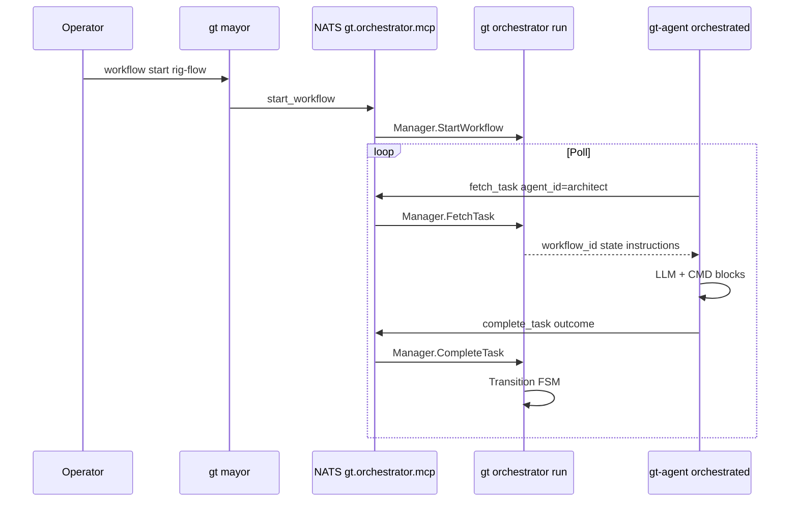

# Orchestrator (technical design)

Technical reference for the Gas Town workflow FSM and MCP service introduced on the
`mcp-orchestrator` branch. For operators, see [Orchestrator (concept)](../concepts/orchestrator.md).

**Status:** Partial implementation. Core FSM and NATS MCP work; parity with the legacy
mayor pipeline is incomplete.

## Status summary

| Area | Status | Notes |
|------|--------|-------|
| YAML template load | Done | `{townRoot}/orchestrator/templates/*.yaml` |
| FSM transition | Done | `WorkflowInstance.Transition` in `types.go` |
| MCP over NATS | Done | Subject `gt.orchestrator.mcp` |
| `gt-agent --orchestrated` | Done | Poll / execute / `complete_task` |
| `gt orchestrator run` | Done | Subprocess from `gt up` |
| `gt mayor workflow start` | Done | Manual only |
| Per-state `prompt_file` (separate .md) | Not done | Target; lift from legacy templates |
| Single-task LLM + structured output | Not done | Multi-turn CMD loop today |
| Idle poll-only (no LLM) | Partial | Sleeps on empty fetch; some roles still legacy LLM |
| Orchestrator-only pipeline agents | Not done | Dual legacy + orchestrated paths today |
| Workflow persistence | Not done | In-memory `Manager.instances` |
| Auto-start on `gt up` | Not done | |
| Variable substitution `{{rig}}` | Not done | |
| `get_workflow_status` tool | Not done | |
| Bundled template schema | Broken | `agent_role` vs `role` |
| QA outcome mapping | Partial | FSM keys vs agent `success`/`fail` |
| Patrol agents not orchestrated | Not done | Witness/refinery still get flag |
| Unit tests `fsm_test.go` / `mcp_test.go` | Not done | |

## Architecture



### Components

| Component | Package / command | Role |
|-----------|-------------------|------|
| **Manager** | `internal/orchestrator/manager.go` | Templates + instances; `FetchTask`, `CompleteTask`, `StartWorkflow` |
| **Server** | `internal/orchestrator/mcp.go` | JSON-RPC 2.0; stdio + NATS subscriber |
| **Client** | `internal/orchestrator/orchestrator.go` | `Call`, `FetchTask`, `CompleteTask`, `StartWorkflow`; PID file |
| **Types** | `internal/orchestrator/types.go` | `WorkflowTemplate`, `State`, `WorkflowInstance` |
| **CLI** | `internal/cmd/orchestrator.go` | `gt orchestrator start\|stop\|status\|run` |
| **Mayor CLI** | `internal/cmd/mayor.go` | `gt mayor workflow start <template>` |
| **Agent loop** | `cmd/gt-agent/main.go` | `runOrchestrated()` when `--orchestrated` |
| **Session flag** | `internal/session/lifecycle.go` | Appends `--orchestrated` when orchestrator PID exists |
| **Town up** | `internal/cmd/up.go` | Starts orchestrator; sets `Orchestrated` on agents |

**Production entry:** `gt orchestrator run` (not the stale `cmd/gt-orchestrator/main.go` binary).

**PID file:** `{townRoot}/daemon/orchestrator.pid`  
**Logs:** `{townRoot}/logs/orchestrator.log`

## Workflow template schema (canonical)

Templates must match Go structs in `types.go` (today). **Target** adds `prompt_file`:

```yaml
id: rig-flow
description: Standard rig pipeline
initial_state: kickoff
states:
  kickoff:
    role: mayor
    prompt_file: prompts/rig-flow/kickoff.md   # relative to {townRoot}/orchestrator/
    instructions: |                            # short user-task hint (optional)
      Verify SPEC for {{rig}}.
    transitions:
      success:
        to: design
      failure:
        to: kickoff
```

### Prompt file layout (target)

```
{townRoot}/orchestrator/
  templates/rig-flow.yaml
  prompts/rig-flow/
    kickoff.md      # system prompt for this state only
    design.md
    planning.md
    implementation.md
    qa_review.md
```

- Lift rules from `internal/templates/roles/*.md.tmpl` into state files; keep each file
  focused on **one FSM step** for weaker LLMs.
- `FetchTask` loads file content, substitutes `{{rig}}` etc. from instance variables,
  returns `system_prompt` + `task_prompt` to `gt-agent`.

**Current YAML** still uses inline `instructions` only; `prompt_file` is not yet in `types.go`.

**Terminal states:** Transitioning *into* state name `completed` or `failed` sets instance
`Status` to that value.

**Invalid bundled format** (do not use):

```yaml
# WRONG for current loader
agent_role: architect
transitions:
  success: prd-review    # must be success: { to: prd-review }
```

## Prompt assembly

### Legacy (`gt-agent` default loop) — not used for pipeline when orchestrator owns dispatch

1. `buildSystemPrompt()` + `gt prime --hook` + `gatherWork()`
2. Being **removed** for pipeline roles (mayor, architect, planner, polecat, qa) when orchestrator runs

### Orchestrated — target (confirmed design)

| Message | Source |
|---------|--------|
| **System** | Contents of `prompt_file` for current state (+ small wrapper: workflow_id, state, allowed outcomes) |
| **User** | “Complete this step only.” + optional YAML `instructions` / substituted vars |

**One LLM task per `fetch_task`:** execute step → structured result → `complete_task` → poll again.

**Structured output (target):**

```json
{
  "outcome": "success",
  "summary": "architecture.md written",
  "commands_run": ["wc -c testgt2/mayor/rig/architecture.md"]
}
```

Validate `outcome` against keys in `state.transitions` before advancing FSM.

**Idle:** `fetch_task` empty → `sleep(poll_interval)` → **no LLM**.

### Orchestrated — current (`runOrchestrated`)

Inline system string + YAML `instructions`; multi-turn CMD loop; `OUTCOME: success|fail` text parsing. See gaps below.

## Agent matching (`FetchTask`)

`Manager.FetchTask(agentID)` scans all instances (no status filter today):

```go
if role == agentID || agentID == "any" || strings.HasSuffix(agentID, "/"+role) {
    return task
}
```

| Agent ID passed | Matches state `role: architect` |
|-----------------|-----------------------------------|
| `architect` | Yes |
| `testgt2/architect` | Yes (suffix) |
| `mayor` at state `design` | No |

**Collision:** `gt up` with orchestrator running may start both `hq-architect` (town) and
`te-<rig>-architect` (rig). First matching instance wins; no rig affinity yet.

**Canonical role** in `gt-agent` comes from `GT_ROLE` / `.gt-agent` via `canonicalRole()`.

## MCP tools (NATS, not IDE MCP)

Transport: NATS request/reply on subject **`gt.orchestrator.mcp`**.  
This is **not** registered in Cursor/Claude `mcpServers`; only `gt-agent` and CLI use it.

| Tool | Arguments | Returns |
|------|-----------|---------|
| `fetch_task` | `agent_id` | `workflow_id`, `state`, `instructions`, `role` (missing `template_id`) |
| `complete_task` | `workflow_id`, `outcome` | `next_state` |
| `start_workflow` | `template_id`, `variables` | `workflow_id` |

JSON-RPC methods: `initialize`, `list_tools`, `call_tool`.

**Planned:** `get_workflow_status` for operators.

### Outcome → transition

`WorkflowInstance.Transition` looks up `state.Transitions[outcome]`. Fallback order:

1. Exact outcome key
2. `success`
3. `default`
4. Stay in current state

**QA example** (`rig-flow.yaml`):

```yaml
qa_review:
  transitions:
    task_passed:
      to: implementation
    all_passed:
      to: completed
    failure:
      to: implementation
```

`runOrchestrated` currently sets outcome only from `OUTCOME: success` / `OUTCOME: fail` in
LLM text — QA branches do not fire unless extended.

## Integration points

### `gt up`

- Starts orchestrator subprocess (`orchestrator.Start`)
- If orchestrator running: `Orchestrated: true` on mayor, deacon, planner, mechanic, witness, refinery, architect, qa
- Also starts town-level `hq-architect`, `hq-qa`, `hq-polecat` when orchestrated

### `gt down`

- Stops orchestrator with other daemons

### Session transport

Independent of orchestrator MCP:

- Town `session_transport: nats` → `gt nats-wrapper` for agent sessions
- Orchestrator uses same broker, different subject

### Template directories

| Location | Loaded when |
|----------|-------------|
| `{townRoot}/orchestrator/templates/` | `gt orchestrator run` (runtime) |
| `internal/orchestrator/templates/` | Not auto-loaded; examples only |

Town templates override/supplement what operators ship; gastown `make install` does not
copy town templates.

## File map

### Gastown source

| Path | Purpose |
|------|---------|
| `internal/orchestrator/types.go` | FSM types, `Transition`, `GetCurrentTask` |
| `internal/orchestrator/manager.go` | Load templates, instances, fetch/complete |
| `internal/orchestrator/mcp.go` | MCP server |
| `internal/orchestrator/orchestrator.go` | NATS client, start/stop, PID |
| `internal/cmd/orchestrator.go` | CLI |
| `internal/cmd/mayor.go` | `workflow start` |
| `internal/cmd/up.go` | Orchestrator + orchestrated agents |
| `cmd/gt-agent/main.go` | `runOrchestrated`, `buildSystemPrompt` |
| `internal/session/lifecycle.go` | `--orchestrated` on command line |
| `internal/templates/roles/*.md.tmpl` | Legacy role prompts |
| `internal/orchestrator/templates/*.yaml` | Example templates (schema fix needed) |

### Town runtime (example)

| Path | Purpose |
|------|---------|
| `orchestrator/templates/rig-flow.yaml` | testgt2 pipeline |
| `daemon/orchestrator.pid` | Running indicator |
| `logs/orchestrator.log` | MCP + manager debug |
| `settings/config.json` | `session_transport`, `role_agents` |

## Known gaps and bugs

1. ~~**In-memory instances**~~ — persisted to `orchestrator/instances.json` (Phase 2)
2. ~~**No auto `start_workflow` on `gt up`**~~ — optional via `orchestrator.auto_start` (Phase 2)
3. **Thin orchestrated prompts** — no role templates / prime hook
4. **`template_id` not returned** from `FetchTask`
5. **Completed instances still scanned** — `Status` not set on create; no skip filter
6. **QA outcomes** — agent `success`/`fail` vs FSM `task_passed`/`all_passed`/`failure`
7. **Bundled YAML schema** — `idea-to-plan.yaml`, `mechanic-patrol.yaml` incompatible
8. **Patrol agents orchestrated** — witness/refinery poll without workflow roles
9. **Duplicate hq + rig agents** for architect/qa/polecat
10. **`cmd/gt-orchestrator/main.go`** — stale, non-compiling; use `gt orchestrator run`
11. **Variable substitution** — `{{review_id}}` in templates not expanded
12. **NATS URL** — hardcoded/default; not read from town settings consistently

## Roadmap (implementation phases)

### P0 — Phase 1 (agent + prompts)

| Change | Files |
|--------|-------|
| `prompt_file` on states; load in `FetchTask` | `types.go`, `manager.go`, `orchestrator/prompts/` |
| Single-task loop + structured JSON outcome | `cmd/gt-agent/main.go` |
| Idle poll-only; no LLM on empty fetch | `cmd/gt-agent/main.go` |
| Pipeline roles orchestrator-only (no `gatherWork`) | `cmd/gt-agent/main.go`, `up.go` |
| Return `template_id`; skip completed instances | `manager.go` |
| Outcome validation vs transitions | `manager.go`, `cmd/gt-agent/main.go` |

### P1 — Phase 2 (operations)

| Change | Files |
|--------|-------|
| Persist instances (beads/Dolt) | `manager.go` |
| Auto-start workflow from settings | `internal/cmd/up.go`, town `settings/config.json` |
| Mayor/rig kickoff calls `StartWorkflow` | `internal/cmd/mayor.go`, rig add |
| `get_workflow_status` MCP tool | `mcp.go` |

### P2 — Phase 3 (templates + topology)

| Change | Files |
|--------|-------|
| Lift legacy role content into state `.md` files | `orchestrator/prompts/rig-flow/*.md` |
| Rig-scoped `FetchTask`; drop duplicate hq agents | `manager.go`, `up.go` |
| Unify bundled template schema + loader validation | `templates/*.yaml`, `manager.go` |
| Witness/refinery/mechanic not orchestrated without FSM | `up.go`, session lifecycle |

## Testing

### Manual (testgt2, from town root)

```bash
cd ~/gt
gt up
gt orchestrator status
gt mayor workflow start rig-flow
tail -f logs/orchestrator.log
# Expect: kickoff → design → planning → implementation → qa_review → completed
```

Verify role logs only receive tasks when FSM role matches (e.g. polecat at `implementation`).

### Automated (planned)

- `fsm_test.go` — transitions, fallbacks, terminal states
- `mcp_test.go` — `fetch_task` / `complete_task` over NATS or in-process server

## Related documentation

- [Orchestrator (concept)](../concepts/orchestrator.md)
- [Architecture](architecture.md) — beads, roles, work orchestration pipeline diagram
- [Molecules](../concepts/molecules.md)
- [Agent provider integration](../agent-provider-integration.md)

## Legacy parallel: molecules and formulas

`.beads/formulas/*.formula.toml` (e.g. `mol-idea-to-plan`) remain a separate coordination
system. They are not wired to the MCP orchestrator. New rig pipelines should prefer
orchestrator YAML once parity is reached; patrol and convoy work stay on molecules/mail.
