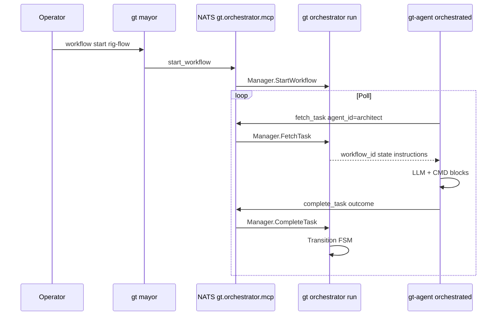

# Orchestrator (technical design)

Technical reference for the Gas Town workflow FSM and MCP service introduced on the
`mcp-orchestrator` branch. For operators, see [Orchestrator (concept)](../concepts/orchestrator.md).

**Status:** Phases 1–3 implemented on `mcp-orchestrator`. Rig-flow FSM, NATS MCP,
persistence, auto-start, per-state prompts, orchestrated agent loop, topology guards,
and unit tests are in place. Remaining gaps: QA outcome aliases, duplicate hq agents
with multiple rigs, full template schema unification for all bundled YAML examples.

## Status summary

| Area | Status | Notes |
|------|--------|-------|
| YAML template load | Done | `{townRoot}/orchestrator/templates/*.yaml` |
| FSM transition | Done | `WorkflowInstance.Transition` in `types.go` |
| MCP over NATS | Done | Subject `gt.orchestrator.mcp` |
| `gt-agent --orchestrated` | Done | Poll, CMD loop, JSON outcome, state guards |
| `gt orchestrator run` | Done | Subprocess from `gt up`; PID + log |
| `gt mayor workflow start\|status\|complete\|reset` | Done | CLI + MCP `start_workflow` / `reset_workflow` |
| Per-rig `workflow-profile.json` | Done | `gt rig spec-index`; merged in `FetchTask` / `gt-agent` guards |
| Spec-driven rig-flow prompts | Done | `{{spec_summary}}`, `{{layout_root}}`, `{{required_files}}`, … in `town/prompts/rig-flow/` |
| Per-state `prompt_file` | Done | `internal/orchestrator/town/prompts/rig-flow/*.md` |
| Structured JSON outcome | Done | `outcome` / `summary` validated vs transitions |
| Idle poll-only (no LLM) | Done | Empty `fetch_task` → sleep, no model call |
| Pipeline roles orchestrator-only | Done | `OrchestratedForRole`; no `gatherWork` when orchestrated |
| Workflow persistence | Done | `{townRoot}/orchestrator/instances.json` |
| Auto-start on `gt up` / `gt rig add` | Done | `orchestrator.auto_start` + `default_workflow` |
| Variable substitution `{{rig}}` | Done | `SubstituteVars` in prompts and instructions |
| `get_workflow_status` MCP tool | Done | + `gt mayor workflow status` |
| Town asset sync | Done | `//go:embed town/`; `make install`, `gt orchestrator sync` |
| Patrol agents not orchestrated | Done | `IsPatrolRole` / `OrchestratedForRole` |
| hq-polecat + legacy pause | Done | `LegacyPolecatsPaused`; `GT_POLECAT` identity fix |
| Per-state YAML `hooks:` | Done | `StateHooks` in `state_hooks.go`; `rig-flow.yaml`; delivered on `fetch_task` |
| Planning state timeout | Done | `state_timeout_seconds`, `on_timeout`, `transitions.timeout`; `workflow_timeout*.go` |
| Workflow stuck monitor | Done | Daemon pipeline keepalive (45s); `workflow_stuck*.go`; deterministic repair |
| Hook interpreter (`state_runner`) | Done | `cmd/gt-agent/state_runner.go` — no FSM state-name switches in `orchestrated.go` |
| Rig-flow checkpoint commits | Done | After each **rig-flow** FSM edge, `refinery.CommitMayorRigOrchestratorCheckpoint` commits dirty `mayor/rig` (**runs inside `gt orchestrator`**, not the refinery tmux patrol). On **completed**, pushes `origin` via `git push -u`. Opt out: `GT_SKIP_WORKFLOW_GIT_COMMIT`, `GT_WORKFLOW_SKIP_PUSH`. `gt rig add` seeds mayor/rig `.gitignore` / `.git/info/exclude` so checkpoints skip beads, DBs, codeindex, and build artifacts. Look for `[Orchestrator] rig … mayor/rig` lines in `{town}/logs/orchestrator.log`. |
| Bundled non-rig-flow templates | Partial | Some examples still use old schema |
| QA outcome mapping | Partial | Prefer `task_passed` / `all_passed` in FSM |
| Verify / runtime smoke vs architecture | **Partial** | [verify-and-smoke-gaps.md](./verify-and-smoke-gaps.md) — GT-VERIFY-003 done (`set -e` smoke); 001/002/004–009 open |
| Unit tests | Done | `manager_test.go`, `prompts_test.go`, `legacy_test.go`, … |

### Rig-flow git checkpoints (`GT_*` env vars)

Checkpoint commits and pushes are **not** done by polecat, QA, or `gt rig sync-upstream` alone. They run inside the **`gt orchestrator run`** process when the FSM advances (see `internal/refinery/orchestrator_checkpoint.go`).

| Variable | Set on | Effect |
|----------|--------|--------|
| `GT_SKIP_WORKFLOW_GIT_COMMIT=1` | Orchestrator process (`gt orchestrator run`, or whatever starts it from `gt up`) | No `git add` / `git commit` on FSM transitions |
| `GT_WORKFLOW_SKIP_PUSH=1` | Same | Commits still run (unless skip commit is set); **no** `git push` when the workflow reaches `completed` |
| `GT_SKIP_SPEC_INDEX=1` | Shell before `gt rig add` | Unrelated to git — skips LLM `workflow-profile.json` generation |

Example (dev rig — local checkpoints only):

```bash
export GT_WORKFLOW_SKIP_PUSH=1
cd ~/gt && gt orchestrator run   # or rely on gt up auto_start
```

Example (no checkpoint noise at all):

```bash
export GT_SKIP_WORKFLOW_GIT_COMMIT=1
```

**Mayor/rig ignore rules:** `gt rig add` and `gt rig add --adopt` call `rig.EnsureMayorRigGitHygiene` on `mayor/rig/` (`.gitignore` + `.git/info/exclude`, and `git rm --cached` for common junk already tracked). Re-run adopt on an existing rig to refresh rules; then manually `git rm -r --cached` anything still tracked from before.

**Manual publish** (orchestrator was old / push skipped): `gt rig sync-upstream <rig>`.

## Architecture



### Components

| Component | Package / command | Role |
|-----------|-------------------|------|
| **Manager** | `internal/orchestrator/manager.go` | Templates + instances; `FetchTask`, `CompleteTask`, `StartWorkflow` |
| **Server** | `internal/orchestrator/mcp.go` | JSON-RPC 2.0; stdio + NATS subscriber |
| **Client** | `internal/orchestrator/orchestrator.go` | `Call`, `FetchTask`, `CompleteTask`, `StartWorkflow`; PID file |
| **Types** | `internal/orchestrator/types.go` | `WorkflowTemplate`, `State`, `StateHooks`, `WorkflowInstance` |
| **State hooks** | `internal/orchestrator/state_hooks.go` | YAML schema + `RetryHintKey` helpers |
| **Hook runner** | `cmd/gt-agent/state_runner.go` | Interprets `task.hooks` from `fetch_task` |
| **CLI** | `internal/cmd/orchestrator.go` | `gt orchestrator start\|stop\|status\|run` |
| **Mayor CLI** | `internal/cmd/mayor.go` | `workflow start\|status\|complete\|reset` |
| **Spec profile** | `internal/specprofile/`, `rig_profile_load.go` | `gt rig spec-index` → `workflow-profile.json` |
| **Prompts / matching** | `internal/orchestrator/prompts.go` | `AgentMatchesTask`, `OrchestratedForRole`, `LoadPromptFile`, `PromptVars` |
| **Legacy pause** | `internal/orchestrator/legacy.go` | `LegacyPolecatsPaused` during active `rig-flow` |
| **Agent loop** | `cmd/gt-agent/main.go` | `runOrchestrated()` when `--orchestrated` |
| **Session flag** | `internal/session/lifecycle.go` | Appends `--orchestrated` when orchestrator PID exists |
| **Town up** | `internal/cmd/up.go` | Starts orchestrator; sets `Orchestrated` on agents |

**Production entry:** `gt orchestrator run` (not the stale `cmd/gt-orchestrator/main.go` binary).

**PID file:** `{townRoot}/daemon/orchestrator.pid`  
**Logs:** `{townRoot}/logs/orchestrator.log`

## Workflow template schema (canonical)

Templates are YAML files under `{townRoot}/orchestrator/templates/`. They map to Go structs in
`types.go` and are loaded by `Manager.LoadTemplatesFromDir`.

A workflow has three configuration layers:

| Layer | Where | What it controls |
|-------|--------|------------------|
| **Template** | `templates/<id>.yaml` | FSM graph, roles, prompts, per-state **hooks** |
| **Template `validation:`** | Same YAML file | Default thresholds (placeholder in rig-flow) |
| **Rig profile** | `{rig}/mayor/rig/.gastown/workflow-profile.json` | Spec-derived paths, verify commands, min bytes (`gt rig spec-index`) |

### Minimal template

```yaml
id: my-flow
description: Example pipeline
initial_state: design
validation:                    # optional; merged with profile at runtime
  min_plan_bytes: 200
states:
  design:
    role: architect
    prompt_file: prompts/my-flow/design.md
    instructions: |
      Write architecture for {{rig}}.
    hooks:                     # optional but required for rig-style enforcement
      cmd_guard: design
      track: design
      artifacts: design
    transitions:
      success:
        to: completed
      failure:
        to: design
  completed:
    role: mayor
    instructions: "Pipeline done."
```

Required per state: `role`, and either `prompt_file` or `instructions`. Transitions use
`outcome: { to: next_state }` (not bare `success: next`).

### Prompt file layout

```
{townRoot}/orchestrator/
  templates/rig-flow.yaml
  prompts/rig-flow/
    kickoff.md      # system prompt for this state only
    design.md
    planning.md
    implementation.md
    qa_review.md
```

- Lift rules from `internal/templates/roles/*.md.tmpl` into state files; keep each file
  focused on **one FSM step** for weaker LLMs.
- `FetchTask` loads file content, substitutes `{{rig}}` etc. from instance variables,
  returns `system_prompt` + `task_prompt` to `gt-agent`.

**Runtime YAML** (`rig-flow.yaml`) sets both `prompt_file` and short `instructions`.
`FetchTask` returns `system_prompt` (file) and task text (instructions + substituted vars).

**Terminal states:** Transitioning *into* state name `completed` or `failed` sets instance
`Status` to that value.

**Invalid bundled format** (do not use):

```yaml
# WRONG for current loader
agent_role: architect
transitions:
  success: prd-review    # must be success: { to: prd-review }
```

## Prompt assembly

### Legacy (`gt-agent` default loop) — not used for pipeline when orchestrator owns dispatch

1. `buildSystemPrompt()` + `gt prime --hook` + `gatherWork()`
2. Being **removed** for pipeline roles (mayor, architect, planner, polecat, qa) when orchestrator runs

### Orchestrated — target (confirmed design)

| Message | Source |
|---------|--------|
| **System** | Contents of `prompt_file` for current state (+ small wrapper: workflow_id, state, allowed outcomes) |
| **User** | “Complete this step only.” + optional YAML `instructions` / substituted vars |

**One LLM task per `fetch_task`:** execute step → structured result → `complete_task` → poll again.

**Structured output (target):**

```json
{
  "outcome": "success",
  "summary": "architecture.md written",
  "commands_run": ["wc -c testgt2/mayor/rig/architecture.md"]
}
```

Validate `outcome` against keys in `state.transitions` before advancing FSM.

**Idle:** `fetch_task` empty → `sleep(poll_interval)` → **no LLM**.

### Orchestrated — current (`runOrchestrated`)

`cmd/gt-agent/orchestrated.go`:

1. `fetch_task` → load `system_prompt` from `prompt_file`
2. Multi-turn **CMD:** loop with per-state command guards
3. JSON `{"outcome","summary",...}` or auto-complete when artifacts validate
4. `complete_task` → FSM transition

**State hooks** (declarative in `orchestrator/templates/rig-flow.yaml` under each state's `hooks:` block; delivered on `fetch_task` as JSON):

| Hook field | Purpose |
|------------|---------|
| `cmd_guard` | Named guard preset (`design`, `planning`, `implementation`, …) |
| `cmd_rewrites` | Command normalizers (`rig_placeholders`, `bd_list_limit`, …) |
| `env` | `beads_dir`, `python_venv` (`create` / `activate`), `pythonpath` |
| `track` | Per-command tracker for artifact validation |
| `auto_verify` | Run verify after matching commands (`go_mod_tidy`, `pip_install`, …) |
| `artifacts` | Success gate preset (`planning`, `implementation`, `qa`, …) |
| `retry_hint` / `failure_hint` | Agent guidance (supports `{{rig}}` substitution) |
| `pre_run` | Hooks before each orchestrated attempt (`repair_planning_beads`, …) |
| `state_timeout_seconds` | Wall-clock limit for this state; `0` = disabled |
| `on_timeout` | Cleanup hooks before `complete_task` outcome `timeout` (`reset_planning_phase`, …) |
| `max_cmd_turns` | LLM CMD turns per `fetch_task` invocation (default 5) |

`gt-agent` interprets hooks via `state_runner.go`; it does not switch on FSM state names.

### State timeout (implementation)

- **`WorkflowInstance.state_entered_at`** — RFC3339 UTC; set on every `Transition`, `StartWorkflow`, and `ResetWorkflow` (`types.go`).
- **`Manager.FetchTask`** — if `now - state_entered_at ≥ state_timeout_seconds`, calls `applyStateTimeout` (`workflow_timeout_apply.go`): runs `RunOnTimeoutHooks`, then `Transition(..., "timeout")`, sets `PendingRework`, persists.
- **`gt-agent`** — on `max_cmd_turns` exhaustion, if `on_timeout` is set and `timeout` is an allowed outcome, runs the same hooks and returns outcome `timeout` instead of `failure`.
- **`reset_planning_phase`** (`plan_beads_order.go`) — delete phase implement beads, remove stale `plan.md`, `EnsurePlanningImplementBeads`, then prune/dedupe.

Allowed outcomes include `timeout` when `transitions.timeout` exists (`State.AcceptsOutcome`). Timeout sets `PendingRework` even for same-state transitions (unlike `failure`, which only sets rework when `next != fromState`).

### Workflow stuck monitor

Rig-flow can stall when beads drift, the rig identity bead is docked, the polecat session dies, or
`plan.md` lacks **Integration contract** while the profile expects a server entrypoint. The
**workflow stuck monitor** runs on the same **daemon pipeline keepalive** tick as agent revival
(45s) and applies **deterministic** repairs—no LLM.

**Package:** `internal/orchestrator/workflow_stuck*.go`  
**Daemon hook:** `internal/daemon/pipeline_keepalive.go` → `RunWorkflowStuckMonitorTick`  
**State file:** `{townRoot}/orchestrator/workflow-stuck-state.json` (bead fingerprints, last repair time per rig)

**Prerequisites:** orchestrator running; active `rig-flow` instance in `instances.json` with
`RigWorkflowRunning` for that rig.

#### Stuck signals

| Signal | Condition |
|--------|-----------|
| `phase_idle_no_bead_progress` | State in `planning`, `plan_review`, `project_setup`, `implementation`, or `qa_review`; past grace (default 10m); implement-bead fingerprint unchanged for ≥ idle threshold (default 30m) |
| `pending_rework_linger` | `pending_rework` set and same state for ≥ rework threshold (default 20m) |
| `polecat_session_missing` | `implementation` for >5m and rig polecat tmux session not running |
| `non_required_implement_beads` | Open/in_progress implement-like beads off `required_files` during planning/implementation |
| `missing_integration_contract` | Server profile (`cmd/.../main.go` in required files) and `plan.md` missing `## Integration contract` |

Repair runs when **any** signal fires and per-rig **cooldown** (default 10m) has elapsed since the last repair.

#### Repair order (idempotent)

1. `EnsureRigBeadOperationalForWorkflow` — clear `status:docked` / `status:parked` on rig bead (beads DB ready)
2. `SyncPlanningArtifacts(..., force)` — same family as `gt rig sync-planning --force`
3. `RepairPlanningBeadSet` — same as `repair_planning_beads` hook
4. `PruneNonRequiredOpenImplementBeads` — when flat/off-profile bead signal fired
5. `ensurePlanIntegrationContract` — patch `plan.md` when contract signal fired
6. `EnforceSingleImplementInProgress` — on idle or rework-linger signals

Polecat session restart is **not** duplicated here; the keepalive pass already calls
`ensureRigPolecatRunning` for rigs with a running workflow.

Pure detection for tests: `EvalWorkflowStuck(WorkflowStuckEvalInput)`.

#### Environment

| Variable | Default | Meaning |
|----------|---------|---------|
| `GT_WORKFLOW_STUCK_MONITOR` | on (`1`) | Set `0` / `false` to disable |
| `GT_WORKFLOW_STUCK_IDLE_MINUTES` | `30` | No implement-bead fingerprint change |
| `GT_WORKFLOW_STUCK_REWORK_MINUTES` | `20` | `pending_rework` linger |
| `GT_WORKFLOW_STUCK_COOLDOWN_MINUTES` | `10` | Minimum gap between repairs per rig |
| `GT_WORKFLOW_STUCK_GRACE_MINUTES` | `10` | Suppress idle detection immediately after state entry |

Daemon logs: `[workflow-stuck] <rig>: repaired (<signals>): <steps>` in `{town}/daemon/daemon.log`.

**Validation merge order:** defaults → `rig-flow.yaml` `validation:` → `{rig}/mayor/rig/.gastown/workflow-profile.json`.
Prompt substitution uses the same merged struct (`PromptVars`).

## Wildcard Rejection in `required_files`

**Planner validation:** `PlanningBeadTitle` rejects paths containing `*`. Architect prompt explicitly forbids wildcards (`test_*.py`, `*_test.go`, `test/*.test.ts`). Each entry must be a concrete, resolvable file path.

## LLM Judge Semantic Validation

**Config:** `gastown/models.json` (or `GASTOWN_MODELS_CONFIG` env)

Three judges run as semantic validators, replacing brittle keyword matching:

| Judge | Function | Validates |
|-------|----------|-----------|
| **Triad** | `ValidateTriadWithJudge` | SPEC ↔ Architecture ↔ Plan coherence (HTTP routes, store API, module names, bead map paths, integration contract) |
| **Test Quality** | `ValidateTestQualityWithJudge` | Test file vs SPEC/Architecture: meaningful names, real assertions, SPEC coverage, no trivial tests |
| **Integration Contract** | `ValidateIntegrationContractWithJudge` | Plan's `## Integration contract` completeness (entrypoint wiring, route registration, exported symbols, DI) |

**Model config** (`gastown/models.json`):
```json
{
  "models": {
    "judge": "deepseek/deepseek-v4-flash",
    "architect": "deepseek/deepseek-v4-flash",
    "planner": "google/gemini-3.5-flash",
    "polecat": "deepseek/deepseek-v4-flash",
    "qa": "google/gemini-3.5-flash",
    "mayor": "google/gemini-3.5-flash",
    "default": "google/gemini-3.5-flash"
  }
}
```

**Fallback:** If LLM endpoint unreachable (connection refused), judges return `pass` with reason "LLM judge unavailable (connection refused), skipping" instead of failing. Configure via `GASTOWN_MODELS_CONFIG` env or place `gastown/models.json` in cwd or `~/gt/gastown/`.

**Integration in validation pipeline:**

| Function | Judge used |
|----------|------------|
| `ValidatePlanningDocAlignment` | Triad (SPEC/Architecture/Plan) |
| `checkArchitectureDockerSection` | Document-level (Docker section) |
| `checkArchitectureIntegrationTestingSection` | Document-level (Integration section) |
| `checkArchitectureE2ETestingSection` | Document-level (E2E section) |
| `ValidatePlanningDocAlignment` | Triad (full SPEC/Architecture/Plan) |

---

## Test Quality & Stubs

**Judge-based:** `ValidateTestQualityWithJudge` evaluates test files against SPEC/Architecture:
- Meaningful test names (not `Test1`, `testFunction`)
- Real assertions (not `assert True`, `assert err == nil`)
- SPEC coverage (happy path, errors, edge cases from acceptance bullets)
- Realistic test data (not "foo", "bar", "test")
- No trivial tests (empty bodies, import-only)

**Deterministic fallback:** `CheckContentNotStub` (byte length, substantive lines, placeholder patterns) runs regardless.

---

## Integration Contract Validation

**Judge-based:** `ValidateIntegrationContractWithJudge` checks Plan's `## Integration contract` for:
1. Entrypoint wiring (how main wires dependencies, initialization order)
2. Route registration (exact SPEC HTTP paths)
3. Exported symbols per file (from Architecture ownership table)
4. DI pattern (constructors, package-level funcs, `registerHandlers`)

---

## Node.js Setup Fix

`nodeInstallDirFromRequiredFiles` now only treats actual manifest files as root packages:
- `package.json`, `pnpm-lock.yaml`, `yarn.lock`, `package-lock.json` → root package
- Other files at root → not treated as package root

Prevents spurious `cd . && npm install` when only source files exist at root.

---

## Directory Handling in Artifact Validation

`beadImplementationNeedsRework` and `auditRequiredImplementFiles` now detect directories via `os.Stat().IsDir()` and validate via `os.ReadDir()` (non-empty) instead of `ReadFile`/`info.Size()`.

---

## Prompt Updates

**Architect prompt** (`town/prompts/rig-flow/design.md`): Explicit rule against wildcards in `required_files`. Each path must be concrete (`tests/test_portfolio.py`, not `tests/test_*.py`).

**Planner prompt** (`town/prompts/rig-flow/planning.md`): Examples updated to concrete paths (`tests/test_portfolio.py` not `tests/test_*.py`).

---

## Model Configuration

**File:** `gastown/models.json` (or `GASTOWN_MODELS_CONFIG` env)

| Key | Default | Role |
|-----|---------|------|
| `judge` | `deepseek/deepseek-v4-flash` | All three judges |
| `architect` | `deepseek/deepseek-v4-flash` | Architecture generation |
| `planner` | `google/gemini-3.5-flash` | Plan generation |
| `polecat` | `deepseek/deepseek-v4-flash` | Implementation |
| `qa` | `google/gemini-3.5-flash` | QA review |
| `mayor` | `google/gemini-3.5-flash` | Workflow management |
| `default` | `google/gemini-3.5-flash` | Fallback |

Environment override: `GASTOWN_MODELS_CONFIG=/path/to/models.json`.

---

## Judge Fallback Behavior

If LLM endpoint unreachable (connection refused), judges return:
```json
{ "pass": true, "reason": "LLM judge unavailable (connection refused), skipping" }
```
Instead of failing. Allows CI/dev without live LLM.

---

## Integration Tests

**File:** `internal/orchestrator/llm_judge_integration_test.go` (build tag `integration`)

Run with freeride proxy:
```bash
# Start proxy
go run ./cmd/freeride proxy --port 11434 &

# Run integration tests
GASTOWN_TEST_FREERIDE=1 go test -tags=integration -run TestJudgeWithFreerideProxy ./internal/orchestrator/
```

Tests:
1. `ValidateDocumentWithJudge` - architecture.md sections
2. `ValidateTriadWithJudge` - SPEC/Architecture/Plan coherence
3. `ValidateTestQualityWithJudge` - test file quality
4. `ValidateIntegrationContractWithJudge` - integration contract completeness

---

## Agent matching (`AgentMatchesTask`)

`Manager.FetchTask` scans active instances and calls `AgentMatchesTask(agentID, state.Role, inst.Variables)` (`prompts.go`):

```go
// Rig-scoped roles (architect, polecat, qa): require "{rig}/{role}" when vars["rig"] set.
// Town-level roles (mayor, planner): bare "{role}" matches.
// agent_id "any" always matches.
```

| `vars["rig"]` | State role | Agent ID | Matches? |
|---------------|------------|----------|------------|
| `testgt2` | architect | `testgt2/architect` | Yes |
| `testgt2` | architect | `architect` | No |
| `testgt2` | qa | `testgt2/qa` | Yes |
| `testgt2` | qa | `qa` | No |
| (any) | mayor | `mayor` | Yes |
| (any) | planner | `planner` | Yes |
| `testgt2` | polecat | `testgt2/polecat` | Yes |
| `testgt2` | polecat | `polecat` | No (legacy town `hq-polecat` only when zero rigs) |

**`gt-agent` agent_id:** from `GT_AGENT_ID` / session name (e.g. `testgt2/architect`).

**Topology (`gt up`):** with orchestrator running and ≥1 rig, rig-scoped architect/qa/polecat start under `{town}/{rig}/`; town `hq-architect` / `hq-qa` / `hq-polecat` are skipped. Per-rig pipeline polecat at `{town}/{rig}/polecat/` handles `implementation` for rig-flow (`agent_id` `{rig}/polecat`).

## `OrchestratedForRole` vs patrol

```go
func OrchestratedForRole(orchestratorRunning bool, role string) bool {
    if !orchestratorRunning || IsPatrolRole(role) { return false }
    return IsPipelineRole(role)
}
```

| Category | Roles | `--orchestrated` when orch running |
|----------|-------|-------------------------------------|
| Pipeline | mayor, architect, planner, polecat, qa | Yes |
| Patrol | witness, refinery, mechanic, deacon | No (legacy patrol) |

Rig pipeline polecat uses `OrchestratedForRole` like architect/qa. Legacy town `hq-polecat` uses `OrchestratedForTownPolecat` only when no rigs are registered.

## `LegacyPolecatsPaused`

While an active `rig-flow` instance exists for a rig, `gt up --restore` skips
`startPolecatsWithWork` for per-bead polecats under `{rig}/polecats/`. Witness sling may
still spawn legacy polecats outside the FSM.

## MCP tools (NATS, not IDE MCP)

Transport: NATS request/reply on subject **`gt.orchestrator.mcp`**.  
This is **not** registered in Cursor/Claude `mcpServers`; only `gt-agent` and CLI use it.

| Tool | Arguments | Returns |
|------|-----------|---------|
| `fetch_task` | `agent_id` | `workflow_id`, `template_id`, `state`, `role`, `system_prompt`, `instructions`, `allowed_outcomes` |
| `complete_task` | `workflow_id`, `outcome`, optional `summary` | `next_state`, `status` |
| `start_workflow` | `template_id`, `variables` (e.g. `rig`) | `workflow_id` |
| `get_workflow_status` | optional `workflow_id` | instance list or single instance JSON |

JSON-RPC methods: `initialize`, `list_tools`, `call_tool`.

### Outcome → transition

`WorkflowInstance.Transition` looks up `state.Transitions[outcome]`. Fallback order:

1. Exact outcome key
2. `success`
3. `default`
4. Stay in current state

**QA example** (`rig-flow.yaml`):

```yaml
qa_review:
  transitions:
    task_passed:
      to: implementation
    all_passed:
      to: completed
    failure:
      to: implementation
```

Agents should emit transition keys from `allowed_outcomes` (e.g. QA: `task_passed`,
`all_passed`, `failure`). `success` / `fail` are accepted as fallbacks where mapped.

## Integration points

### `gt up`

- Starts orchestrator subprocess (`orchestrator.Start`)
- `OrchestratedForRole` → `--orchestrated` only on pipeline roles (not witness/refinery/mechanic/deacon)
- `gt up --orchestrator-only` skips legacy town `hq-architect` / `hq-qa` / `hq-polecat` when orchestrator runs
- Rig-scoped architect/qa/polecat when rigs exist; legacy `hq-polecat` only with zero rigs
- `MaybeAutoStartWorkflow` when `settings.config.orchestrator.auto_start`
- `RepairIdentityFiles` for polecat worktrees; `LegacyPolecatsPaused` skips legacy polecat restore
- `ensureDaemon` polls up to 3s for `daemon.lock` (same as `gt daemon start`; avoids false “daemon failed” under load)
- Daemon ensures **town** `hq-mechanic` at `{town}/mechanic/` (not only per-rig mechanics)
- NATS session liveness: `IsAgentRunning` walks process tree for `gt-agent`; status shows `nats (N sessions)` when not using tmux

### `gt down`

- Stops orchestrator with other daemons

### Session transport

Independent of orchestrator MCP:

- Town `session_transport: nats` → `gt nats-wrapper` for agent sessions
- Orchestrator uses same broker, different subject

### Template directories

| Location | Loaded when |
|----------|-------------|
| `{townRoot}/orchestrator/templates/` | `gt orchestrator run` (runtime) |
| `internal/orchestrator/town/` (gastown) | Source; embedded + synced via `make install` / `gt orchestrator sync` |
| `internal/orchestrator/templates/` | Legacy examples only; not embedded |

`make install` copies `town/templates` and `town/prompts` into `{townRoot}/orchestrator/`.

## File map

### Gastown source

| Path | Purpose |
|------|---------|
| `internal/orchestrator/types.go` | FSM types, `Transition`, `GetCurrentTask` |
| `internal/orchestrator/manager.go` | Load templates, instances, fetch/complete/reset |
| `internal/specprofile/` | `gt rig spec-index` LLM extraction |
| `internal/orchestrator/rig_profile_load.go` | Load `{rig}/mayor/rig/.gastown/workflow-profile.json` |
| `internal/orchestrator/mcp.go` | MCP server |
| `internal/orchestrator/orchestrator.go` | NATS client, start/stop, PID |
| `internal/cmd/orchestrator.go` | CLI |
| `internal/cmd/mayor.go` | `workflow start` |
| `internal/cmd/up.go` | Orchestrator + orchestrated agents |
| `cmd/gt-agent/main.go` | `runOrchestrated`, `buildSystemPrompt` |
| `internal/session/lifecycle.go` | `--orchestrated` on command line |
| `internal/templates/roles/*.md.tmpl` | Legacy role prompts |
| `internal/orchestrator/town/templates/rig-flow.yaml` | Canonical rig-flow (embedded) |
| `internal/orchestrator/town/prompts/rig-flow/*.md` | Per-state system prompts |
| `cmd/gt-agent/orchestrated.go` | Orchestrated loop + guards |
| `internal/orchestrator/provision.go` | `//go:embed town/` |

### Town runtime (example)

| Path | Purpose |
|------|---------|
| `orchestrator/templates/rig-flow.yaml` | Rig pipeline FSM |
| `orchestrator/prompts/rig-flow/*.md` | Per-state prompts |
| `orchestrator/instances.json` | Persisted workflow instances (`gt mayor workflow reset` rewinds `current_state`) |
| `{rig}/mayor/rig/.gastown/workflow-profile.json` | Per-rig validation + prompt variables |
| `daemon/orchestrator.pid` | Running indicator |
| `logs/orchestrator.log` | MCP + manager debug |
| `settings/config.json` | `orchestrator.*`, `session_transport`, `role_agents` |

## Known gaps and bugs

1. **QA outcomes** — FSM keys `task_passed` / `all_passed` vs agent habit of `success` / `fail`
2. **Legacy sling polecats** — can still run parallel to hq-polecat; identity repair helps but does not remove witness path
3. **Bundled non-rig-flow YAML** — some files under `internal/orchestrator/templates/` use old schema
4. **Completed instances** — may still be scanned until status filter tightened
5. **Multi-rig towns** — hq vs rig agent duplication returns when multiple rigs registered
6. **`cmd/gt-orchestrator/main.go`** — stale; use `gt orchestrator run`
7. **Beads/Dolt backing** — instances are JSON file only (not beads yet)

## Roadmap (implementation phases)

### Phase 1 — agent + prompts (done)

Per-state `prompt_file`, orchestrated poll loop, JSON outcomes, idle without LLM,
pipeline roles skip `gatherWork`, `template_id` in `fetch_task`.

### Phase 2 — operations (done)

`orchestrator/instances.json` persistence, `get_workflow_status`, `reset_workflow`,
`orchestrator.auto_start` / `default_workflow`, `gt mayor workflow status|complete|reset`,
`gt orchestrator sync`, `gt rig spec-index`.

### Phase 3 — topology + guards (done)

`AgentMatchesTask` rig affinity, `OrchestratedForRole`, hq-polecat, `LegacyPolecatsPaused`,
polecat identity repair, planning/implementation CMD guards, rig-flow prompt pack in
`internal/orchestrator/town/`.

### Future

| Change | Notes |
|--------|-------|
| Persist instances in beads/Dolt | Replace or mirror JSON file |
| Unify all bundled template YAML | Single schema with loader validation |
| Stop legacy sling polecats during rig-flow | Beyond restore skip |
| Full QA outcome aliases + prompt tables | Match FSM keys exactly |
| Hybrid molecules ↔ orchestrator | Optional; formulas remain separate today |

## Testing

### Manual (testgt2, from town root)

```bash
cd ~/gt
gt up
gt orchestrator status
gt mayor workflow start rig-flow --rig testgt2
tail -f logs/orchestrator.log
# Expect: kickoff → design → planning → implementation → qa_review → completed
```

Verify:

- `testgt2/architect` only active in `design`
- `~/gt/polecat` only in `implementation` (`testgt2/polecat`)
- `testgt2/qa` only in `qa_review` (not `~/gt/qa`)

### Automated

```bash
go test ./internal/orchestrator/...
```

Covers `AgentMatchesTask`, `OrchestratedForRole`, `LegacyPolecatsPaused`, FSM transitions,
`CompleteTask`, `FetchTask`, `GetWorkflowStatus`, template validation.

## Related documentation

- [Orchestrator (concept)](../concepts/orchestrator.md)
- [Architecture](architecture.md) — beads, roles, work orchestration pipeline diagram
- [Molecules](../concepts/molecules.md)
- [Agent provider integration](../agent-provider-integration.md)

## Legacy parallel: molecules and formulas

`.beads/formulas/*.formula.toml` (e.g. `mol-idea-to-plan`) remain a separate coordination
system. They are not wired to the MCP orchestrator. New rig pipelines should prefer
orchestrator YAML once parity is reached; patrol and convoy work stay on molecules/mail.
