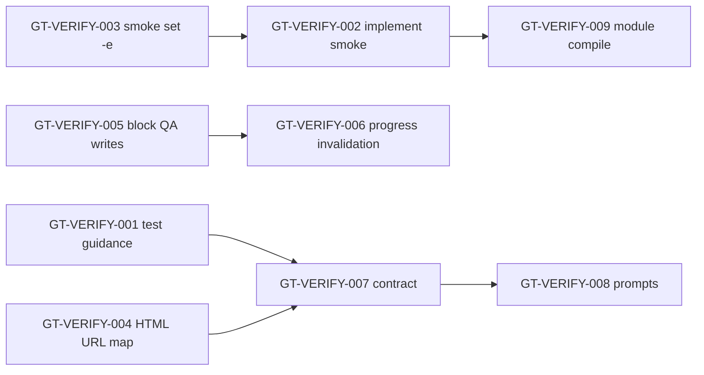

# Verification and runtime smoke gaps

**Status:** Open (tracked from testgt3 / linkshelf incident, May 2026)  
**Related:** [Orchestrator design](./orchestrator.md), rig-flow `implementation.md` / `qa_review.md`

## Incident summary

Rig **testgt3** (`linkshelf/`) reached **implementation complete** and **QA `all_passed`** while `cd linkshelf && go run ./cmd/server` returned **404** on `/` and static assets. `/api/links` worked.

Root cause was not missing tests but **misaligned contracts**: architecture said `web/` + `/static/*`, handlers used CWD `index.html` + on-disk `static/`, unit tests used `os.Chdir` temp layouts that matched the wrong handler, and QA validators/smoke did not enforce the architecture contract end-to-end.

---

## Issue index

| ID | Priority | Title |
|----|----------|--------|
| [GT-VERIFY-001](#gt-verify-001-polecat-tests-need-architecture-layout-not-chdir-fiction) | P0 | Polecat tests must use real `web/` layout |
| [GT-VERIFY-002](#gt-verify-002-implement-verify-must-assert-http-routing-contract) | P0 | Implement verify: HTTP routing contract |
| [GT-VERIFY-003](#gt-verify-003-smoke-shell-must-fail-fast-set--e) | P0 | Smoke shell must fail fast (`set -e`) |
| [GT-VERIFY-004](#gt-verify-004-html-static-validation-must-match-server-urls-not-disk-only) | P1 | HTML validation vs server URLs |
| [GT-VERIFY-005](#gt-verify-005-qa-must-not-mutate-implementation-files) | P1 | QA must not mutate implementation |
| [GT-VERIFY-006](#gt-verify-006-qa-progress-must-not-restore-smoke-without-rerun) | P1 | QA progress: no stale smoke milestone |
| [GT-VERIFY-007](#gt-verify-007-cross-file-routing-consistency-at-bead-close) | P2 | Cross-file routing at bead close |
| [GT-VERIFY-008](#gt-verify-008-prompts-single-source-of-truth-for-static-urls) | P2 | Prompts: one static URL story |
| [GT-VERIFY-009](#gt-verify-009-module-compileok-after-implementation) | P2 | Post-implementation integration probe |

---

## GT-VERIFY-001: Polecat tests need architecture layout, not chdir fiction

**Priority:** P0  
**Files:** `internal/orchestrator/implement_bead_context.go`, `internal/orchestrator/town/prompts/rig-flow/implementation.md`

### Problem

Polecats are told to write tests mapped to architecture, but nothing forbids **httptest + `os.Chdir`** layouts that differ from `web/` on disk. Example pattern (testgt3):

- Production: `linkshelf/web/index.html`
- Test: temp dir with `index.html` at root and `static/test.txt` under `static/`

`go test ./internal/api/...` passes; production server fails.

### Suggested behavior

1. In **Implement context** for `internal/api/handlers*.go` and `*_test.go` beads, inject explicit guidance:
   - Do **not** use `os.Chdir` to fake static paths.
   - Use a fixed `webRoot` (e.g. `"web"`) in the handler under test, or `httptest` with `filepath.Join("..", "..", "web", ...)` from package dir.
   - Table cases must include paths from **architecture.md** (`GET /`, `GET /static/app.js`, traversal `..` → 403/404).

2. Optional: `gt-agent` **reject** `os.Chdir` in `*_test.go` bodies for handler test beads (lint-style guard).

### Acceptance criteria

- [x] New rig-flow guidance merged in `implementation.md` + `FormatHTTPRoutingGuidanceForBead` in implement context.
- [x] Example tests in `implement_bead_context_test.go` and `http_contract_test.go`.
- [x] `ValidateImplementWrittenContent` rejects `os.Chdir` in handler `*_test.go` (native EDIT/WRITE guard).

---

## GT-VERIFY-002: Implement verify must assert HTTP routing contract

**Priority:** P0  
**Files:** `internal/orchestrator/layout_go_files.go`, `internal/orchestrator/go_workflow.go`, `cmd/gt-agent/implement_post_write.go`, `cmd/gt-agent/state_runner_registry.go`

### Problem

Per-bead verify runs **`go test` / `go build` scoped to package** only. `GoCompileVerifyCommandForBead` never checks that handler code matches `architecture.md` routes or `web/` tree.

`go run`/curl is restricted to `cmd/server/main.go` bead and is easy to skip under stall pressure.

### Suggested behavior

1. When closing beads that touch **both** `internal/api/handlers.go` and `web/index.html` (or after last of the pair), run **`orchestrator.BuildRuntimeSmokeShell`** once from `layout_root` (or a lighter `curl` subset: `/`, all `StaticAssets` from `index.html`, one API GET).

2. Add **`ImplementationHTTPContractOK(rigDir, v)`** used:
   - After handler or web HTML bead verify passes (post-write hook), and/or
   - In `ImplementationModuleCompileOK` before implementation phase completes.

3. Parse **architecture.md** / SPEC HTTP table for expected `GET /` and static prefix; fail verify if handler source does not reference `web/` (heuristic: `web/index.html`, `filepath.Join(..., "web", ...)`, or embedded `//go:embed`).

### Acceptance criteria

- [x] Closing `handlers.go` without `web/` on disk fails post-write verify (`ValidateHTTPHandlerBeadPrerequisites`) and implement context warns (May 2026).
- [x] Implement bead order: `web/` paths score before `internal/api/` (`implementationPathScore` 15 vs 20).
- [x] `TestServeIndex`/`TestServeStatic` 404 → `FormatHandlerStatic404Hint` (do not chase `../../web` path tweaks).
- [x] `ImplementationPhaseVerifyOK` runs `BuildRuntimeSmokeShell` when profile has `web/` + `cmd/server/main.go` (before implementation success / QA handoff).
- [x] Unit tests in `implement_runtime_smoke_test.go` cover smoke pass/fail on minimal fixture.

---

## GT-VERIFY-003: Smoke shell must fail fast (`set -e`)

**Status:** Done (May 2026) — `BuildRuntimeSmokeShell` uses `set -euo pipefail` + `&&` chain; `runOrchestratedCommand` wraps agent smoke via `wrapStrictBashSmoke`.

**Priority:** P0  
**Files:** `internal/orchestrator/qa_smoke_spec.go` (`BuildRuntimeSmokeShell`), `cmd/gt-agent/orchestrated_exec.go` (`runOrchestratedCommand`, `isGoDevServerSmokeCommand`)

### Problem

Profile-derived smoke runs as **`bash -c '<chain>'`** without `set -e`. The `/` probe uses:

```bash
test "$_gtok" = 1
```

If `curl /` fails but later `curl /api/links` succeeds, the **overall exit code can be 0** → `qaSmokeOK = true`.

Script-file path uses `set -euo pipefail`; inline smoke does not.

### Suggested behavior

1. Prefix `BuildRuntimeSmokeShell` output with `set -euo pipefail; ` **or** chain every step with `&&` (including `test "$_gtok" = 1`).

2. In `runOrchestratedCommand`, when `isGoDevServerSmokeCommand(cmd)` is true, wrap rewritten smoke:

   ```bash
   set -euo pipefail; <built smoke>
   ```

3. Add test: mock failing `/` + passing API → command must exit non-zero.

### Acceptance criteria

- [x] `TestBuildRuntimeSmokeShell_*` asserts `set -e` or all-`&&` chain.
- [x] `orchestrated_exec_test.go`: `TestWrapStrictBashSmoke`; `TestBuildRuntimeSmokeShell_failFastBeforeAPICheck`.
- [x] `TestSimplifyGoDevServerSmoke_goRunWithoutCurl`; `TestStateRunner_rewriteCommand_qaGoRunSleepOnly` (regression for sleep-only QA CMD).
- [ ] Manual: linkshelf broken `/` + working API → smoke fails (re-verify on next testgt3 QA run).

---

## GT-VERIFY-004: HTML static validation must match server URLs, not disk-only

**Priority:** P1  
**Files:** `cmd/gt-agent/orchestrated.go` (`validateWebStaticReferences`, `webRefPath`, `webRefExists`), `internal/orchestrator/qa_smoke_spec.go` (`staticAssetsFromRig`)

### Problem

`validateWebStaticReferences` checks that **files exist under `web/`** for each `src`/`href`. It does **not** check that the **handler serves that URL**.

- Architecture: `/static/app.js` → file `web/app.js`
- Validator: `/static/app.js` → looks for `web/static/app.js` (wrong)
- QA “fix”: change HTML to `/app.js` → passes file check; server still 404

`staticAssetsFromRig` reads HTML for smoke curls (good) but validation logic diverges for `/static/` prefix.

### Suggested behavior

1. **`webRefExists` for URL paths:** Map URL → filesystem using **architecture static prefix** from profile or parsed architecture:
   - If route is `GET /static/{file}` → disk path `web/{file}`
   - If route serves `web/` at root → disk path `web/{file}` for `/file`

2. Add **`validateHTMLRefsServedByHandler(rigDir, v)`** (optional static analysis): grep `handlers.go` for `ServeFile` / `http.FileServer` paths and compare to `index.html` refs.

3. Fail QA pass if HTML refs are satisfied on disk but **smoke curl** for those refs failed in the same session (tie validation to `hadCmdFailure` / last smoke output).

### Acceptance criteria

- [x] `/static/app.js` in HTML validates against `web/app.js` when architecture defines `/static/{file}` → `web/`.
- [x] `orchestrated_qa_web_test.go` covers prefix mapping; regression for testgt3 sed case.
- [x] `qa_review.md` points at architecture.md for static URL shape.

---

## GT-VERIFY-005: QA must not mutate implementation files

**Priority:** P1  
**Files:** `cmd/gt-agent/orchestrated.go`, `cmd/gt-agent/orchestrated_exec.go`, `internal/orchestrator/town/prompts/rig-flow/qa_review.md`, `internal/orchestrator/beads_rework.go`

### Problem

QA agent ran `sed` on `linkshelf/web/index.html` to pass validators, then reported `all_passed`. That hides implementation defects and leaves handlers wrong.

### Suggested behavior

1. In **qa** hook / `runOrchestratedCommand`, **reject** writes under `layout_root/` except explicit allowlist (none for rig-flow QA).

2. Block: `sed -i`, `> file`, `tee`, heredoc redirects, `EDIT:`/`WRITE:` if ever enabled for QA role.

3. On smoke/validation failure, **`beads_rework`** path: `outcome: failure` → implementation reopen for beads `te-ga2` / `te-tua` (handler + index), not QA self-fix.

4. Prompt: `qa_review.md` — “Do not edit files under `{{layout_root}}/`. Report failure with bead IDs to reopen.”

### Acceptance criteria

- [x] QA `sed`/`>` on `mayor/rig/linkshelf/**` rejected with clear error (`QACommandMutatesLayoutSource` + `validateQACommand`).
- [x] Rework transition reopens handler/web beads on smoke failure (`ReopenImplementationBeadsAfterQAFailure` / `qaRuntimeFailureSummary`).
- [x] Prompt updated; tests in `orchestrated_test.go` and `qa_write_guard_test.go`.

---

## GT-VERIFY-006: QA progress must not restore smoke without rerun

**Priority:** P1  
**Files:** `cmd/gt-agent/qa_review_progress.go`, `cmd/gt-agent/state_runner_registry.go` (`applyQAProgressToTrack`)

### Problem

`qa-review-progress.json` sets `runtime_smoke: true` across sessions. `applyQAProgressToTrack` sets `qaSmokeOK` without re-running smoke. Combined with NATS timeout on `complete_task`, operator can see “passed” progress while rig is broken.

### Suggested behavior

1. Persist **smoke command hash** (or spec fingerprint from `LoadAPISmokeSpecFromRig`) + **timestamp**; restore milestone only if rig tree unchanged (git hash of `index.html` + `handlers.go`).

2. On QA session start for `all_passed` attempt, always require **one successful smoke CMD in this session** (ignore restored `runtime_smoke` for final validation).

3. Clear `runtime_smoke` when implementation phase re-enters from rework.

### Acceptance criteria

- [x] Fresh QA session cannot `all_passed` with only stale `qa-review-progress.json` (`qaSmokeOK` session-only).
- [x] `qa_review_progress_smoke_test.go` covers invalidation on file change.
- [x] Implementation rework clears smoke milestone (`clearQAReviewProgressIfLeaving` on qa_review → implementation).

---

## GT-VERIFY-007: Cross-file routing consistency at bead close

**Priority:** P2  
**Files:** `cmd/gt-agent/implement_post_write.go`, `internal/orchestrator/implement_path_validate.go`, new `internal/orchestrator/http_contract.go`

### Problem

Beads close independently: `handlers.go`, `web/index.html`, `handlers_test.go` never checked together for one routing story.

### Suggested behavior

1. **`HTTPContractFromArchitecture(rigDir)`** — parse `GET /`, `GET /static/{file}`, static asset lines from `architecture.md`.

2. **`ValidateHTTPContract(rigDir, contract)`** — after any of {handlers, index.html, app.js} write:
   - HTML refs ⊆ served paths implied by handler + contract
   - Required files exist under `web/`

3. Surface violations in **post-write verify** feedback (which bead to reopen).

### Acceptance criteria

- [x] Mismatched `/app.js` vs `/static/app.js` fails post-write via `ValidateHTTPContract` on handler/web writes.
- [x] Tests with fixture rig dir in `http_contract_test.go`.

---

## GT-VERIFY-008: Prompts single source of truth for static URLs

**Priority:** P2  
**Files:** `internal/orchestrator/town/prompts/rig-flow/qa_review.md`, `implementation.md`, `internal/orchestrator/town/templates/rig-flow.yaml`

### Problem

`qa_review.md` says static paths “often `/app.js`, **not** `/static/app.js` unless the server defines `/static/`”. Architecture for testgt3 explicitly requires `/static/`. Agents follow whichever they read last.

### Suggested behavior

1. Replace hardcoded examples with: “Use **From architecture.md** HTTP table and `index.html` refs; smoke curls are built from those refs.”

2. Rig-flow template QA step: “Static asset URLs must match architecture; do not change HTML to satisfy a failing curl unless architecture says so.”

### Acceptance criteria

- [x] No contradictory `/app.js` vs `/static/` examples in rig-flow prompts (`{{static_url_contract_*}}` from `rig_flow_static_urls.go`).
- [x] `prompts_test.go` covers embedded `qa_review.md` / `implementation.md` and yaml instructions.

---

## GT-VERIFY-009: Module compile OK after implementation

**Status:** Done (May 2026) — `ImplementationPhaseVerifyOK` = `ImplementationModuleCompileOK` + `ImplementationRuntimeSmokeOK` (`BuildRuntimeSmokeShell`, GT-VERIFY-003 fail-fast).

**Priority:** P2  
**Files:** `internal/orchestrator/implement_compile.go`, `implement_runtime_smoke.go`, `cmd/gt-agent/orchestrated.go` (`validateImplementationArtifacts`), `beads_rework.go`

### Problem

`ImplementationModuleCompileOK` runs `go test ./...` only — same chdir-fiction tests as per-bead verify.

### Behavior

For Go profiles with `web/` + `cmd/server/main.go`, **`ImplementationPhaseVerifyOK`** runs compile then profile-derived **`BuildRuntimeSmokeShell`** from `layout_root` before implementation may complete or beads stay closed after QA rework.

### Acceptance criteria

- [x] Implementation cannot complete (`validateImplementationArtifacts`) if smoke fails on mayor/rig tree.
- [x] `implement_runtime_smoke_test.go` integration tests (smoke pass/fail + `ImplementationPhaseVerifyOK` on minimal fixture).

---

## Suggested implementation order



1. **GT-VERIFY-003** — smallest change, stops false-green smoke immediately.  
2. **GT-VERIFY-002 + 009** — catch routing bugs before QA.  
3. **GT-VERIFY-001 + 007 + 004** — keep polecats writing tests that mean something.  
4. **GT-VERIFY-005 + 006 + 008** — harden QA phase integrity.

---

## References (testgt3)

| Artifact | Location |
|----------|----------|
| Broken handler | `~/gt/testgt3/mayor/rig/linkshelf/internal/api/handlers.go` |
| Misleading tests | `.../handlers_test.go` (`os.Chdir`) |
| Architecture contract | `~/gt/testgt3/mayor/rig/architecture.md` (§ handlers, `web/`) |
| QA sed + smoke log | `~/gt/testgt3/qa/typescript` (~lines 9748–9831) |
| Stale QA progress | `~/gt/testgt3/qa/qa-review-progress.json` |
